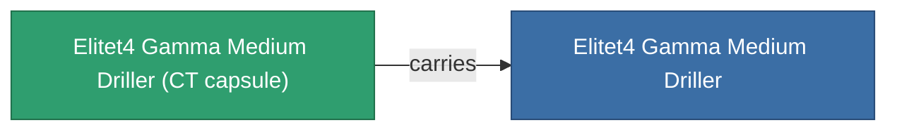

<!-- Generated by tools/generate from the live database (source: entitydefaults definition 6216, aggregatevalues via aggregatefields).
     Do not edit by hand; regenerate instead. -->

# Elitet4 Gamma Medium Driller

|  |  |
|---|---|
| Definition | `def_elitet4_gamma_medium_driller` |
| Tier | T4 (special) |
| Health | 100 |
| Volume | 1.5 |
| Mass | 750 |
| Category | Modules / Enhancements |
| Note | elite module |

## Stats

| Field | Value |
|---|---|
| core_usage | 65 |
| cpu_usage | 52 |
| cycle_time | 9.4k |
| optimal_range | 10 |
| powergrid_usage | 162 |

## Transport capsule

A transport capsule (CT) exists for this item — it is how the item moves between players and zones.

## Where to buy

Fixed-price vendors that sell this item (see the [Item shop](/content/shop/) for the full catalog).

| Vendor | Qty | Credits | UniCoin |
|---|---|---|---|
| Daoden outpost | ∞ | 500M | 25k |

<!-- production:generated -->
## Production

**Produced from 4 components** — assemble the components to build it (see [Recipes](/content/recipes/) for the full list):

<svg class="prod-card-icon" aria-hidden="true"><use href="#mi-grid"/></svg><a class="prod-card-name" href="/content/items/material-boss-gamma-nuimqol/">Material Boss Gamma Nuimqol</a>

required: <b>134</b>

<svg class="prod-card-icon" aria-hidden="true"><use href="#mi-grid"/></svg><a class="prod-card-name" href="/content/items/material-boss-gamma-pelistal/">Material Boss Gamma Pelistal</a>

required: <b>134</b>

<svg class="prod-card-icon" aria-hidden="true"><use href="#mi-grid"/></svg><a class="prod-card-name" href="/content/items/material-boss-gamma-thelodica/">Material Boss Gamma Thelodica</a>

required: <b>134</b>

<svg class="prod-card-icon" aria-hidden="true"><use href="#mi-panel"/></svg><a class="prod-card-name" href="/content/items/named3-medium-driller/">Ovostec-Edger medium miner module</a>

required: <b>1</b>

