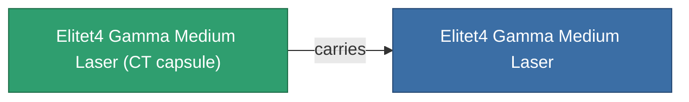

<!-- Generated by tools/generate from the live database (source: entitydefaults definition 6208, aggregatevalues via aggregatefields).
     Do not edit by hand; regenerate instead. -->

# Elitet4 Gamma Medium Laser

|  |  |
|---|---|
| Definition | `def_elitet4_gamma_medium_laser` |
| Tier | 4 |
| Health | 100 |
| Volume | 1 |
| Mass | 550 |
| Category | Modules / Weapons |
| Note | elite module |

## Stats

| Field | Value |
|---|---|
| accuracy | 11.5 |
| core_usage | 17.6 |
| cpu_usage | 29 |
| cycle_time | 5k |
| damage_modifier | 1.7 |
| falloff | 10 |
| least_optimal | 6 |
| optimal_range | 19 |
| powergrid_usage | 238 |

## Transport capsule

A transport capsule (CT) exists for this item — it is how the item moves between players and zones.

## Where to buy

Fixed-price vendors that sell this item (see the [Item shop](/content/shop/) for the full catalog).

| Vendor | Qty | ASI Coin | Credits |
|---|---|---|---|
| Daoden outpost | ∞ | 5k | 750M |

[All items](/content/items/)
