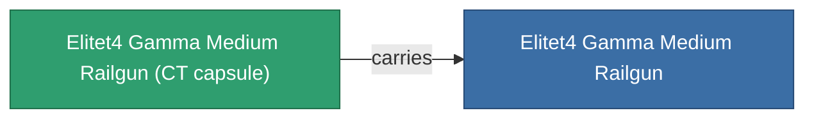

<!-- Generated by tools/generate from the live database (source: entitydefaults definition 6211, aggregatevalues via aggregatefields).
     Do not edit by hand; regenerate instead. -->

# Elitet4 Gamma Medium Railgun

|  |  |
|---|---|
| Definition | `def_elitet4_gamma_medium_railgun` |
| Tier | T4 (special) |
| Health | 100 |
| Volume | 1 |
| Mass | 550 |
| Category | Modules / Weapons |
| Note | elite module |

## Stats

| Field | Value |
|---|---|
| accuracy | 13.5 |
| core_usage | 18 |
| cpu_usage | 36 |
| cycle_time | 8k |
| damage_modifier | 3.25 |
| falloff | 6 |
| least_optimal | 13 |
| optimal_range | 17.5 |
| powergrid_usage | 171 |

## Transport capsule

A transport capsule (CT) exists for this item — it is how the item moves between players and zones.

## Where to buy

Fixed-price vendors that sell this item (see the [Item shop](/content/shop/) for the full catalog).

| Vendor | Qty | ICS Coin | Credits |
|---|---|---|---|
| Daoden outpost | ∞ | 5k | 750M |

<!-- production:generated -->
## Production

**Produced from 2 components** — assemble the components to build it (see [Recipes](/content/recipes/) for the full list):

<svg class="prod-card-icon" aria-hidden="true"><use href="#mi-grid"/></svg><a class="prod-card-name" href="/content/items/material-boss-gamma-nuimqol/">Material Boss Gamma Nuimqol</a>

required: <b>400</b>

<svg class="prod-card-icon" aria-hidden="true"><use href="#mi-grid"/></svg><a class="prod-card-name" href="/content/items/named3-medium-railgun/">Prompt medium Gauss gun</a>

required: <b>1</b>

