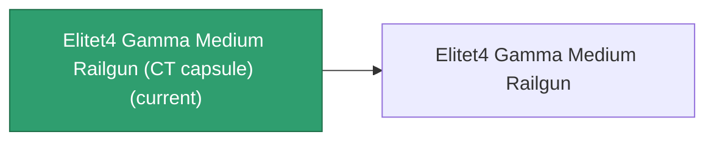

<!-- Generated by tools/generate from the live database (source: entitydefaults definition 6241, aggregatevalues via aggregatefields).
     Do not edit by hand; regenerate instead. -->

# Elitet4 Gamma Medium Railgun (CT capsule)

|  |  |
|---|---|
| Definition | `def_elitet4_gamma_medium_railgun_CT_capsule` |
| Tier | 4 |
| Health | 100 |
| Volume | 0.1 |
| Mass | 0.1 |
| Category | Modules / Weapons |
| Note | elite module ct capsule |

_No stats — this item carries no aggregate values._

## Production

The item this capsule carries, and how it is produced (see [Recipes](/content/recipes/) for the full list).

|  |  |
|---|---|
| Research level | – |
| Production cost | Prompt medium Gauss gun ×1, Material Boss Gamma Nuimqol ×400 |
| Output | [Elitet4 Gamma Medium Railgun](/content/items/elitet4-gamma-medium-railgun/) |

## Where to buy

Fixed-price vendors that sell this item (see the [Item shop](/content/shop/) for the full catalog).

| Vendor | Qty | ICS Coin | Credits |
|---|---|---|---|
| New Virginia (zone_TM) | 1 | 80 | 1600000 |
| Attalica (zone_ICS) | 1 | 80 | 1600000 |
| Attalica outpost | 1 | 80 | 1600000 |
| Daoden (zone_ASI) | 1 | 80 | 1600000 |
| Daoden outpost | 1 | 80 | 1600000 |

[All items](/content/items/)
