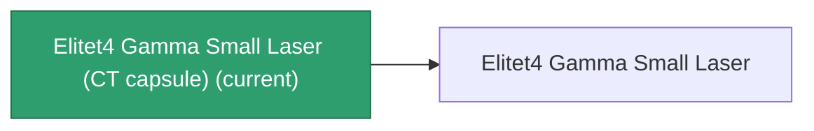

<!-- Generated by tools/generate from the live database (source: entitydefaults definition 6237, aggregatevalues via aggregatefields).
     Do not edit by hand; regenerate instead. -->

# Elitet4 Gamma Small Laser (CT capsule)

|  |  |
|---|---|
| Definition | `def_elitet4_gamma_small_laser_CT_capsule` |
| Tier | 4 |
| Health | 100 |
| Volume | 0.1 |
| Mass | 0.1 |
| Category | Modules / Weapons |
| Note | elite module ct capsule |

_No stats — this item carries no aggregate values._

## Production

The item this capsule carries, and how it is produced (see [Recipes](/content/recipes/) for the full list).

|  |  |
|---|---|
| Research level | – |
| Production cost | Thelotec-Stroyar light HCL laser ×1, Material Boss Gamma Thelodica ×200 |
| Output | [Elitet4 Gamma Small Laser](/content/items/elitet4-gamma-small-laser/) |

## Where to buy

Fixed-price vendors that sell this item (see the [Item shop](/content/shop/) for the full catalog).

| Vendor | Qty | ASI Coin | Credits |
|---|---|---|---|
| New Virginia (zone_TM) | 1 | 40 | 800000 |
| Attalica (zone_ICS) | 1 | 40 | 800000 |
| Attalica outpost | 1 | 40 | 800000 |
| Daoden (zone_ASI) | 1 | 40 | 800000 |
| Daoden outpost | 1 | 40 | 800000 |

[All items](/content/items/)
