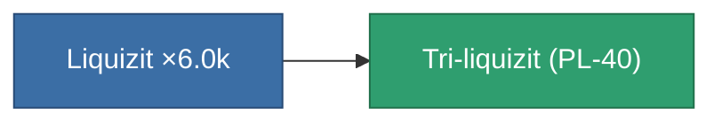

<!-- Generated by tools/generate from the live database (source: entitydefaults definition 4015, aggregatevalues via aggregatefields).
     Do not edit by hand; regenerate instead. -->

# Tri-liquizit (PL-40)

|  |  |
|---|---|
| Definition | `def_liquizit_rare_medium` |
| Tier | – |
| Health | 100 |
| Volume | 0.02 |
| Mass | 300 |
| Category | Materials |

_No stats — this item carries no aggregate values._

<!-- production:generated -->
## Production

**Produced from 1 component** — assemble the components to build it (see [Recipes](/content/recipes/) for the full list):

[All items](/content/items/)
