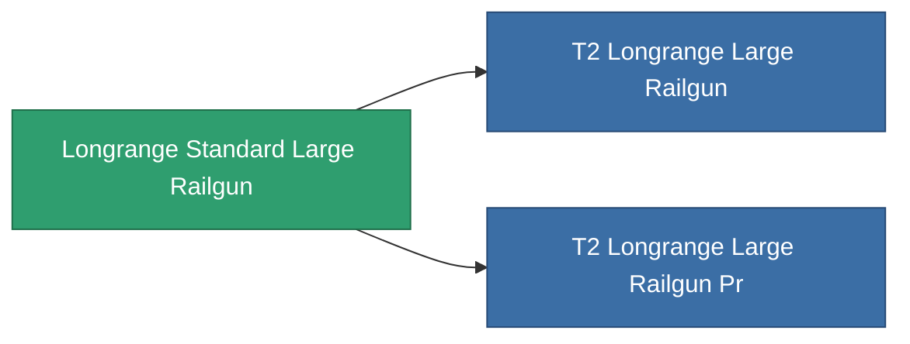

<!-- Generated by tools/generate from the live database (source: entitydefaults definition 1001, aggregatevalues via aggregatefields).
     Do not edit by hand; regenerate instead. -->

# Longrange Standard Large Railgun

|  |  |
|---|---|
| Definition | `def_longrange_standard_large_railgun` |
| Tier | T1 |
| Health | 100 |
| Volume | 1.5 |
| Mass | 1300 |
| Category | Modules / Weapons |

## Stats

| Field | Value |
|---|---|
| accuracy | 42 |
| core_usage | 18.9 |
| cpu_usage | 100 |
| cycle_time | 10k |
| damage_modifier | 3 |
| falloff | 25.5 |
| optimal_range | 46 |
| powergrid_usage | 277.5 |

<!-- production:generated -->
## Production

**Produced from 6 components** — assemble the components to build it (see [Recipes](/content/recipes/) for the full list):

<svg class="prod-card-icon" aria-hidden="true"><use href="#mi-grid"/></svg><a class="prod-card-name" href="/content/items/axicol/">Cryoperine</a>

required: <b>75</b>

<svg class="prod-card-icon" aria-hidden="true"><use href="#mi-grid"/></svg><a class="prod-card-name" href="/content/items/axicoline/">Axicoline</a>

required: <b>150</b>

<svg class="prod-card-icon" aria-hidden="true"><use href="#mi-grid"/></svg><a class="prod-card-name" href="/content/items/chollonin/">Chollonin</a>

required: <b>75</b>

<svg class="prod-card-icon" aria-hidden="true"><use href="#mi-grid"/></svg><a class="prod-card-name" href="/content/items/polynitrocol/">Polynitrocol</a>

required: <b>150</b>

<svg class="prod-card-icon" aria-hidden="true"><use href="#mi-grid"/></svg><a class="prod-card-name" href="/content/items/specimen-sap-item-flux/">Specimen Sap Item Flux</a>

required: <b>10</b>

<svg class="prod-card-icon" aria-hidden="true"><use href="#mi-grid"/></svg><a class="prod-card-name" href="/content/items/titanium/">Titanium</a>

required: <b>150</b>

## Used in production

**Component of 2 items** — everything that uses it in production:

