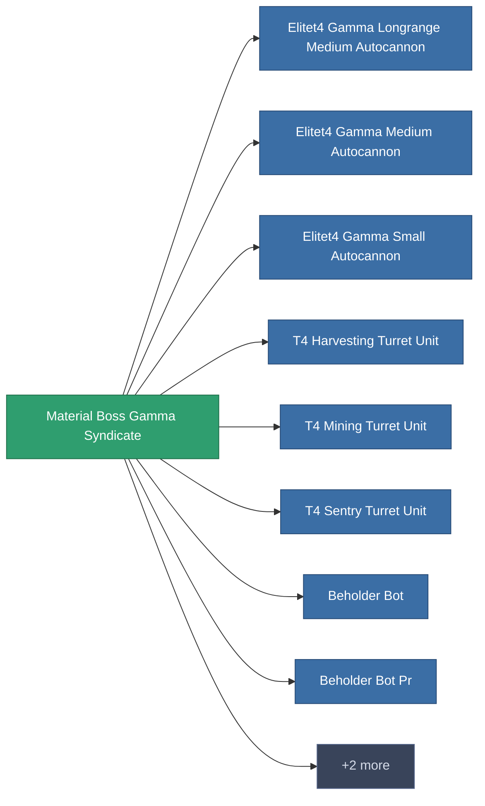

<!-- Generated by tools/generate from the live database (source: entitydefaults definition 6203, aggregatevalues via aggregatefields).
     Do not edit by hand; regenerate instead. -->

# Material Boss Gamma Syndicate

|  |  |
|---|---|
| Definition | `def_material_boss_gamma_syndicate` |
| Tier | – |
| Health | 100 |
| Volume | 0 |
| Mass | 0.25 |
| Category | Materials |
| Note | elite module material |

_No stats — this item carries no aggregate values._

<!-- production:generated -->
## Used in production

**Component of 10 items** — a sample of what can be produced with it (the full list is in [Recipes](/content/recipes/)).

