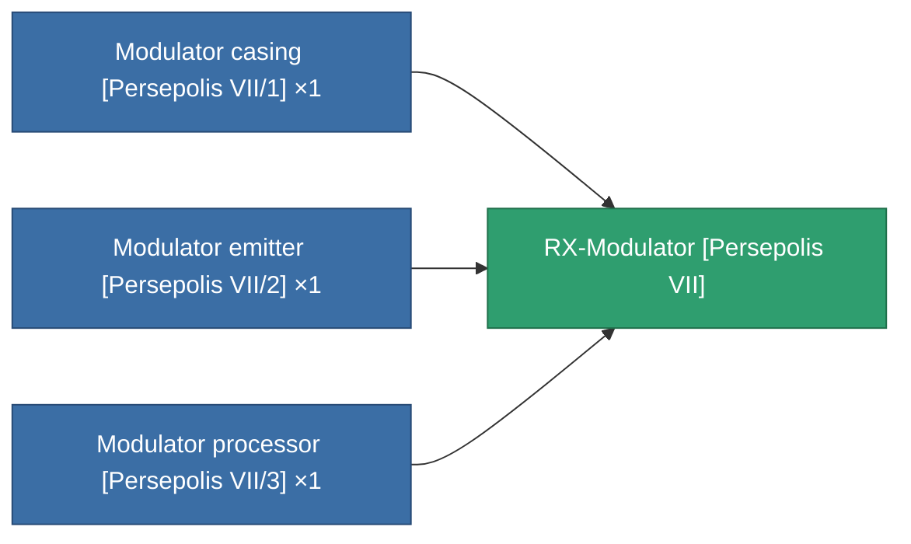

<!-- Generated by tools/generate from the live database (source: entitydefaults definition 3950, aggregatevalues via aggregatefields).
     Do not edit by hand; regenerate instead. -->

# RX-Modulator [Persepolis VII]

|  |  |
|---|---|
| Definition | `def_missionitem_asi_ii_level01_exp3_07_t04` |
| Tier | – |
| Health | 100 |
| Volume | 3 |
| Mass | 1500 |
| Category | Mission items |

_No stats — this item carries no aggregate values._

<!-- production:generated -->
## Production

**Produced from 3 components, research level 2** — assemble the components to build it (see [Recipes](/content/recipes/) for the full list):

[All items](/content/items/)
