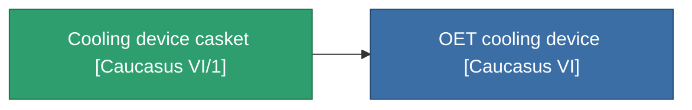

<!-- Generated by tools/generate from the live database (source: entitydefaults definition 4115, aggregatevalues via aggregatefields).
     Do not edit by hand; regenerate instead. -->

# Cooling device casket [Caucasus VI/1]

|  |  |
|---|---|
| Definition | `def_missionitem_asi_ii_level02_exp3_06_t01` |
| Tier | – |
| Health | 100 |
| Volume | 1 |
| Mass | 50 |
| Category | Mission items |

_No stats — this item carries no aggregate values._

<!-- production:generated -->
## Used in production

**Component of 1 items** — everything that uses it in production:

[All items](/content/items/)
