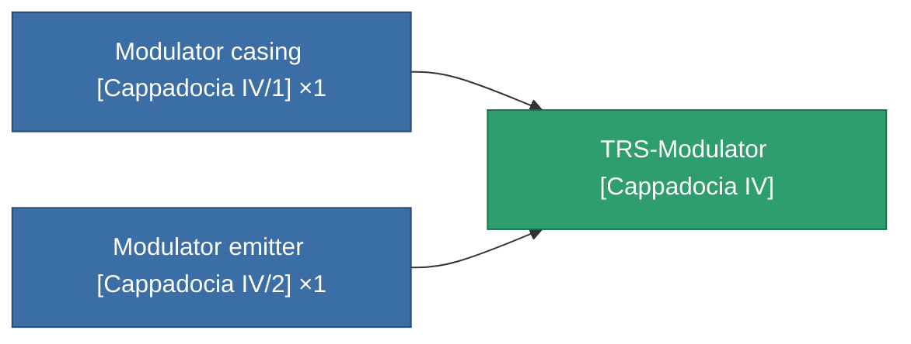

<!-- Generated by tools/generate from the live database (source: entitydefaults definition 3946, aggregatevalues via aggregatefields).
     Do not edit by hand; regenerate instead. -->

# TRS-Modulator [Cappadocia IV]

|  |  |
|---|---|
| Definition | `def_missionitem_ics_ii_level01_exp3_04_t03` |
| Tier | – |
| Health | 100 |
| Volume | 2 |
| Mass | 1000 |
| Category | Mission items |

_No stats — this item carries no aggregate values._

<!-- production:generated -->
## Production

**Produced from 2 components, research level 1** — assemble the components to build it (see [Recipes](/content/recipes/) for the full list):

[All items](/content/items/)
