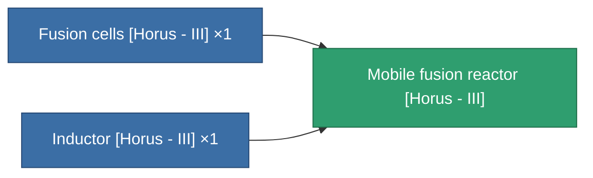

<!-- Generated by tools/generate from the live database (source: entitydefaults definition 4988, aggregatevalues via aggregatefields).
     Do not edit by hand; regenerate instead. -->

# Mobile fusion reactor [Horus - III]

|  |  |
|---|---|
| Definition | `def_missionitem_tm_i_level05_exp3_03_t06` |
| Tier | – |
| Health | 100 |
| Volume | 1 |
| Mass | 50 |
| Category | Mission items |

_No stats — this item carries no aggregate values._

<!-- production:generated -->
## Production

**Produced from 2 components, research level 1** — assemble the components to build it (see [Recipes](/content/recipes/) for the full list):

[All items](/content/items/)
