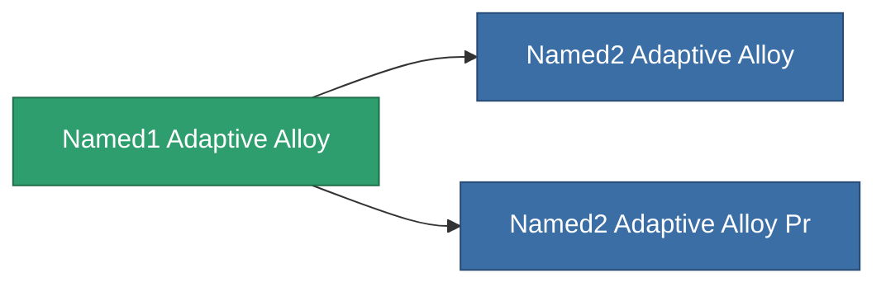

<!-- Generated by tools/generate from the live database (source: entitydefaults definition 8790, aggregatevalues via aggregatefields).
     Do not edit by hand; regenerate instead. -->

# Named1 Adaptive Alloy

|  |  |
|---|---|
| Definition | `def_named1_adaptive_alloy` |
| Tier | 2 |
| Health | 100 |
| Volume | 1.5 |
| Mass | 460 |
| Category | Modules / Enhancements |

## Stats

| Field | Value |
|---|---|
| adaptive_resist_points | 60 |
| cpu_usage | 35 |
| powergrid_usage | 11 |

<!-- production:generated -->
## Production

**Component of 2 items** — everything that uses it in production:

[All items](/content/items/)
