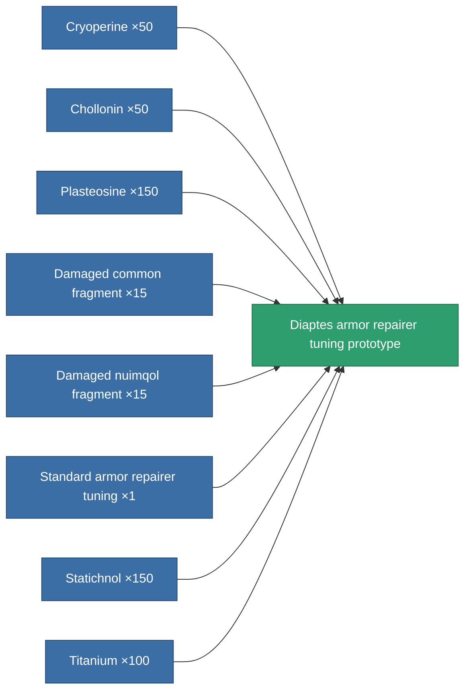

<!-- Generated by tools/generate from the live database (source: entitydefaults definition 2345, aggregatevalues via aggregatefields).
     Do not edit by hand; regenerate instead. -->

# Diaptes armor repairer tuning prototype

|  |  |
|---|---|
| Definition | `def_named1_armor_repairer_upgrade_pr` |
| Tier | 2 |
| Health | 100 |
| Volume | 0.5 |
| Mass | 216 |
| Category | Modules / Repair |

## Stats

| Field | Value |
|---|---|
| armor_repair_amount_modifier | 1.08 |
| armor_repair_cycle_time_modifier | 0.96 |
| cpu_usage | 30 |
| powergrid_usage | 21 |

<!-- production:generated -->
## Production

**Produced from 8 components, research level 4** — assemble the components to build it (see [Recipes](/content/recipes/) for the full list):

[All items](/content/items/)
