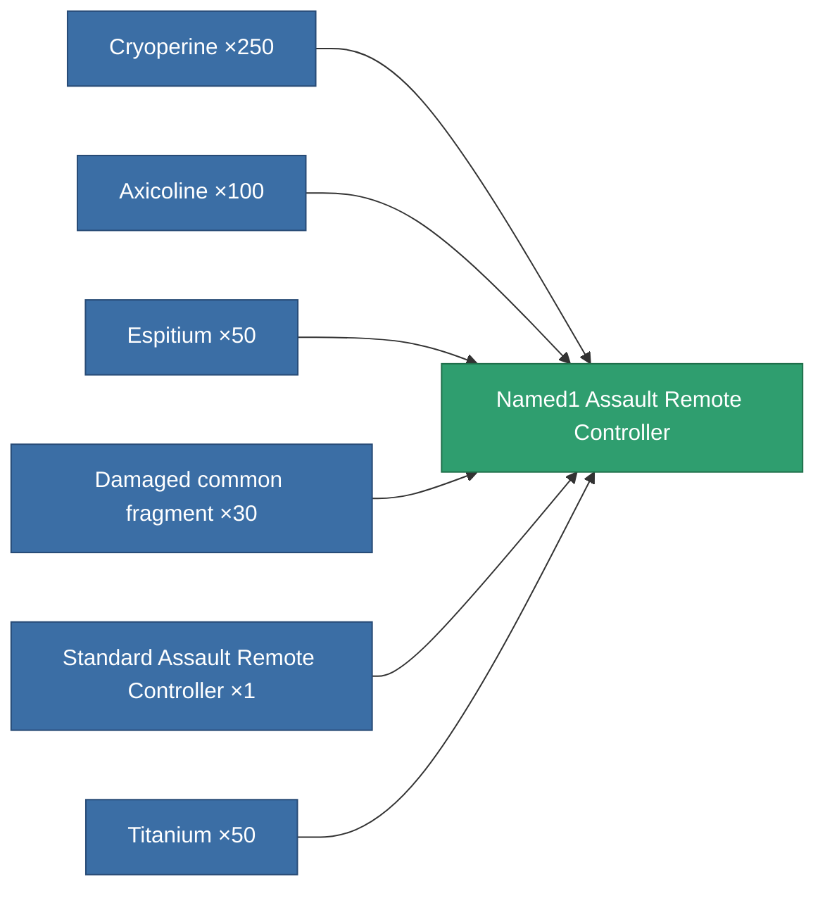
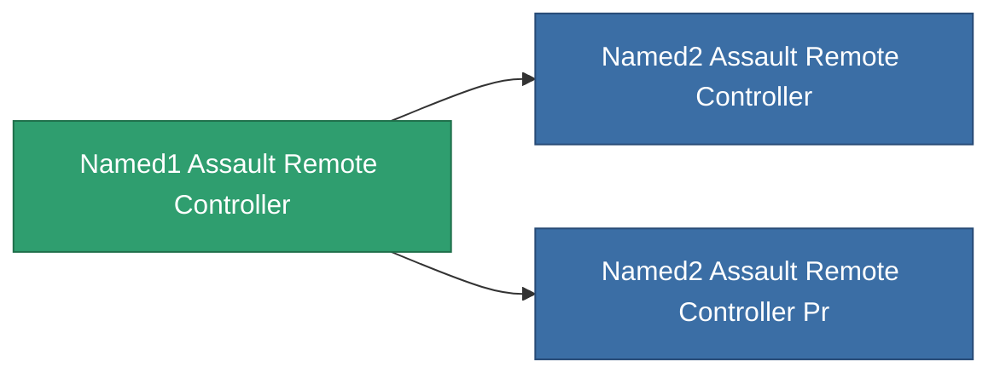

<!-- Generated by tools/generate from the live database (source: entitydefaults definition 8325, aggregatevalues via aggregatefields).
     Do not edit by hand; regenerate instead. -->

# Named1 Assault Remote Controller

|  |  |
|---|---|
| Definition | `def_named1_assault_remote_controller` |
| Tier | 2 |
| Health | 100 |
| Volume | 1 |
| Mass | 1 |
| Category | Modules / Remote control |

## Stats

| Field | Value |
|---|---|
| core_usage | 135 |
| cpu_usage | 225 |
| cycle_time | 10k |
| drone_amplification_accuracy_modifier | 1 |
| drone_amplification_armor_max_modifier | 1 |
| drone_amplification_core_max_modifier | 1 |
| drone_amplification_core_recharge_time_modifier | 1 |
| drone_amplification_cycle_time_modifier | 1 |
| drone_amplification_damage_modifier | 1 |
| drone_amplification_locking_time_modifier | 1 |
| drone_amplification_long_range_modifier | 1 |
| drone_amplification_reactor_radiation_modifier | 1 |
| drone_amplification_speed_max_modifier | 1 |
| powergrid_usage | 60 |
| remote_control_bandwidth_max | 5 |
| remote_control_lifetime | 180k |
| remote_control_operational_range | 20 |

<!-- production:generated -->
## Production

**Produced from 6 components** — assemble the components to build it (see [Recipes](/content/recipes/) for the full list):

## Used in production

**Component of 2 items** — everything that uses it in production:

[All items](/content/items/)
