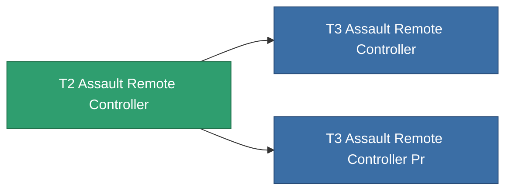

<!-- Generated by tools/generate from the live database (source: entitydefaults definition 8325, aggregatevalues via aggregatefields).
     Do not edit by hand; regenerate instead. -->

# T2 Assault Remote Controller

|  |  |
|---|---|
| Definition | `def_named1_assault_remote_controller` |
| Tier | T2 |
| Health | 100 |
| Volume | 1 |
| Mass | 1 |
| Category | Modules / Remote control |
| Tier line | [Standard Assault Remote Controller](/content/items/standard-assault-remote-controller/) (T1) → **T2 Assault Remote Controller** (T2) → [T3 Assault Remote Controller](/content/items/named2-assault-remote-controller/) (T3) → [T4 Assault Remote Controller](/content/items/named3-assault-remote-controller/) (T4) |

## Stats

| Field | Value |
|---|---|
| core_usage | 135 |
| cpu_usage | 225 |
| cycle_time | 10k |
| drone_amplification_accuracy_modifier | 1 |
| drone_amplification_armor_max_modifier | 1 |
| drone_amplification_core_max_modifier | 1 |
| drone_amplification_core_recharge_time_modifier | 1 |
| drone_amplification_cycle_time_modifier | 1 |
| drone_amplification_damage_modifier | 1 |
| drone_amplification_locking_time_modifier | 1 |
| drone_amplification_long_range_modifier | 1 |
| drone_amplification_reactor_radiation_modifier | 1 |
| drone_amplification_speed_max_modifier | 1 |
| powergrid_usage | 60 |
| remote_control_bandwidth_max | 5 |
| remote_control_lifetime | 180k |
| remote_control_operational_range | 20 |

<!-- production:generated -->
## Production

**Produced from 6 components** — assemble the components to build it (see [Recipes](/content/recipes/) for the full list):

<svg class="prod-card-icon" aria-hidden="true"><use href="#mi-grid"/></svg><a class="prod-card-name" href="/content/items/axicol/">Cryoperine</a>

required: <b>250</b>

<svg class="prod-card-icon" aria-hidden="true"><use href="#mi-grid"/></svg><a class="prod-card-name" href="/content/items/axicoline/">Axicoline</a>

required: <b>100</b>

<svg class="prod-card-icon" aria-hidden="true"><use href="#mi-grid"/></svg><a class="prod-card-name" href="/content/items/espitium/">Espitium</a>

required: <b>50</b>

<svg class="prod-card-icon" aria-hidden="true"><use href="#mi-crystal"/></svg><a class="prod-card-name" href="/content/items/robotshard-common-basic/">Damaged common fragment</a>

required: <b>30</b>

<svg class="prod-card-icon" aria-hidden="true"><use href="#mi-grid"/></svg><a class="prod-card-name" href="/content/items/standard-assault-remote-controller/">Standard Assault Remote Controller</a>

required: <b>1</b>

<svg class="prod-card-icon" aria-hidden="true"><use href="#mi-grid"/></svg><a class="prod-card-name" href="/content/items/titanium/">Titanium</a>

required: <b>50</b>

## Used in production

**Component of 2 items** — everything that uses it in production:

