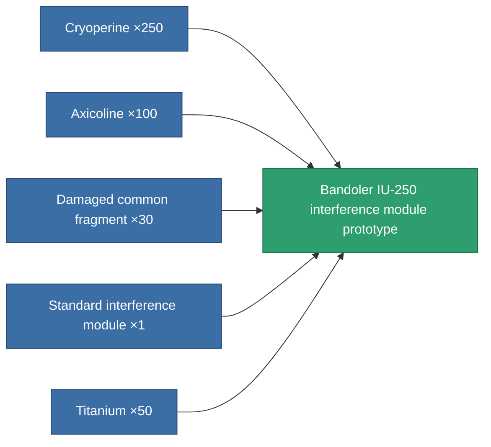

<!-- Generated by tools/generate from the live database (source: entitydefaults definition 2860, aggregatevalues via aggregatefields).
     Do not edit by hand; regenerate instead. -->

# Bandoler IU-250 interference module prototype

|  |  |
|---|---|
| Definition | `def_named1_blob_emission_modulator_pr` |
| Tier | T2 (prototype) |
| Health | 100 |
| Volume | 0.5 |
| Mass | 100 |
| Category | Modules / Enhancements |
| Tier line | [Standard interference module](/content/items/standard-blob-emission-modulator/) (T1) → [Bandoler IU-250 interference module](/content/items/named1-blob-emission-modulator/) (T2) → **Bandoler IU-250 interference module prototype** (T2) → [Bandoler IV-500 interference module](/content/items/named2-blob-emission-modulator/) (T3) → [Omini interference module](/content/items/named3-blob-emission-modulator/) (T4) |

## Stats

| Field | Value |
|---|---|
| blob_emission_modifier | 1 |
| blob_emission_radius_modifier | 1 |
| core_usage | 40 |
| cpu_usage | 70 |
| cycle_time | 5k |
| optimal_range | 30 |
| powergrid_usage | 120 |

<!-- production:generated -->
## Production

**Produced from 5 components, research level 6** — assemble the components to build it (see [Recipes](/content/recipes/) for the full list):

[All items](/content/items/)
