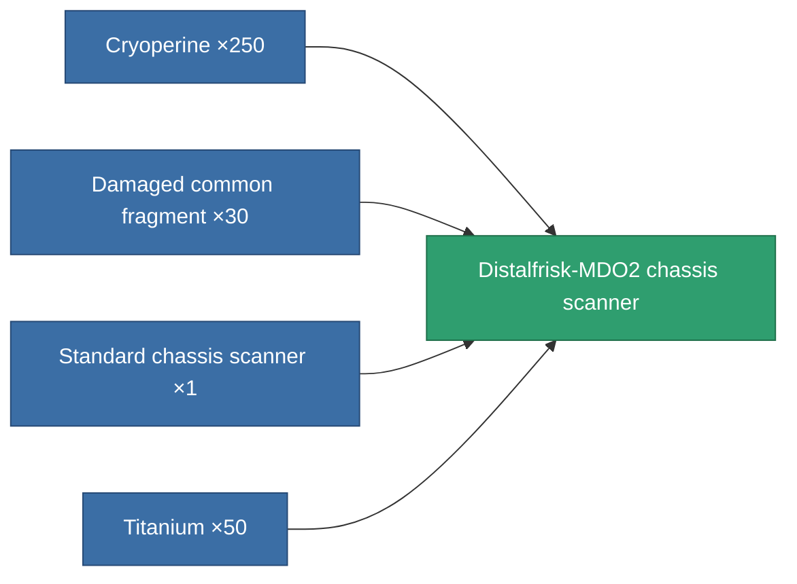
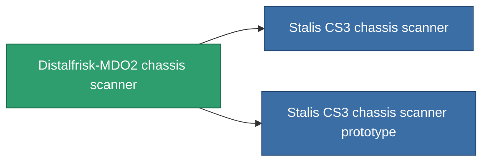

<!-- Generated by tools/generate from the live database (source: entitydefaults definition 777, aggregatevalues via aggregatefields).
     Do not edit by hand; regenerate instead. -->

# Distalfrisk-MDO2 chassis scanner

|  |  |
|---|---|
| Definition | `def_named1_chassis_scanner` |
| Tier | 2 |
| Health | 100 |
| Volume | 0.5 |
| Mass | 180 |
| Category | Modules / Sensors & scanning |

## Stats

| Field | Value |
|---|---|
| core_usage | 18 |
| cpu_usage | 12 |
| cycle_time | 7.5k |
| falloff | 10 |
| optimal_range | 30 |
| powergrid_usage | 4 |

<!-- production:generated -->
## Production

**Produced from 4 components, research level 4** — assemble the components to build it (see [Recipes](/content/recipes/) for the full list):

## Used in production

**Component of 2 items** — everything that uses it in production:

[All items](/content/items/)
