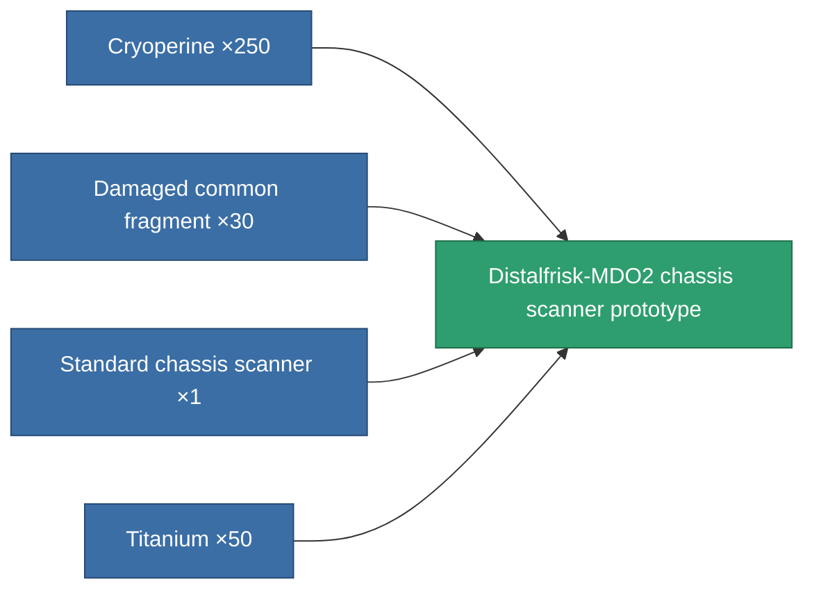

<!-- Generated by tools/generate from the live database (source: entitydefaults definition 2246, aggregatevalues via aggregatefields).
     Do not edit by hand; regenerate instead. -->

# Distalfrisk-MDO2 chassis scanner prototype

|  |  |
|---|---|
| Definition | `def_named1_chassis_scanner_pr` |
| Tier | T2 (prototype) |
| Health | 100 |
| Volume | 0.5 |
| Mass | 135 |
| Category | Modules / Sensors & scanning |
| Tier line | [Standard chassis scanner](/content/items/standard-chassis-scanner/) (T1) → [Distalfrisk-MDO2 chassis scanner](/content/items/named1-chassis-scanner/) (T2) → **Distalfrisk-MDO2 chassis scanner prototype** (T2) → [Stalis CS3 chassis scanner](/content/items/named2-chassis-scanner/) (T3) → [sy-D-930 chassis scanner](/content/items/named3-chassis-scanner/) (T4) |

## Stats

| Field | Value |
|---|---|
| core_usage | 16 |
| cpu_usage | 11 |
| cycle_time | 7.5k |
| falloff | 10 |
| optimal_range | 30 |
| powergrid_usage | 4 |

<!-- production:generated -->
## Production

**Produced from 4 components, research level 4** — assemble the components to build it (see [Recipes](/content/recipes/) for the full list):

[All items](/content/items/)
