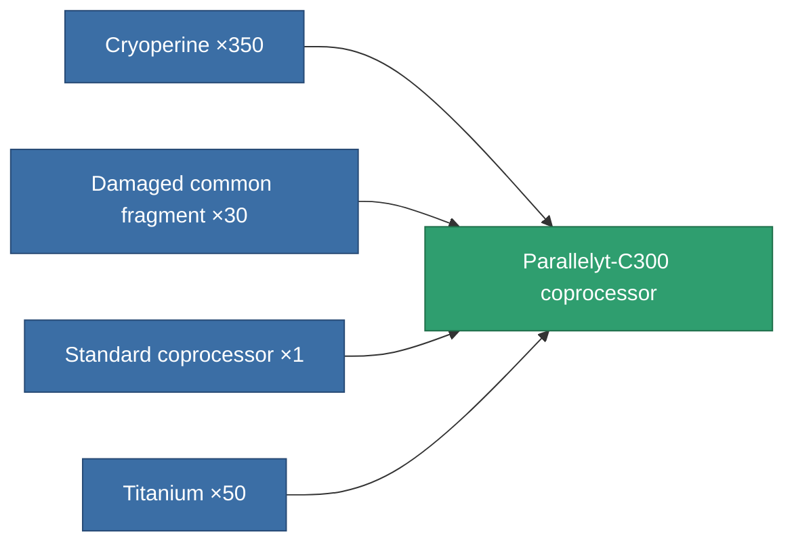
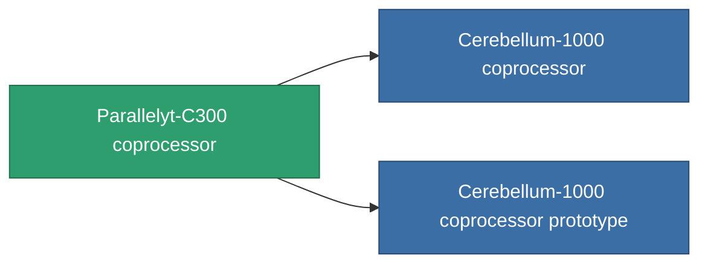

<!-- Generated by tools/generate from the live database (source: entitydefaults definition 783, aggregatevalues via aggregatefields).
     Do not edit by hand; regenerate instead. -->

# Parallelyt-C300 coprocessor

|  |  |
|---|---|
| Definition | `def_named1_cpu_upgrade` |
| Tier | T2 |
| Health | 100 |
| Volume | 0.01 |
| Mass | 0.2 |
| Category | Modules / Enhancements |
| Tier line | [Standard coprocessor](/content/items/standard-cpu-upgrade/) (T1) → **Parallelyt-C300 coprocessor** (T2) → [Cerebellum-1000 coprocessor](/content/items/named2-cpu-upgrade/) (T3) → [Processyt-C1000 coprocessor](/content/items/named3-cpu-upgrade/) (T4) |

## Stats

| Field | Value |
|---|---|
| cpu_max_modifier | 1.1 |
| cpu_usage | 0 |
| powergrid_usage | 2 |

<!-- production:generated -->
## Production

**Produced from 4 components, research level 4** — assemble the components to build it (see [Recipes](/content/recipes/) for the full list):

## Used in production

**Component of 2 items** — everything that uses it in production:

[All items](/content/items/)
