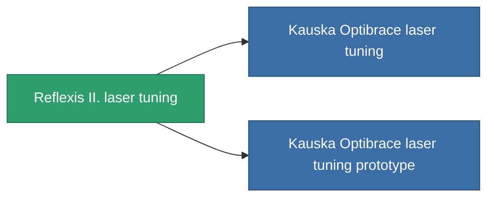

<!-- Generated by tools/generate from the live database (source: entitydefaults definition 930, aggregatevalues via aggregatefields).
     Do not edit by hand; regenerate instead. -->

# Reflexis II. laser tuning

|  |  |
|---|---|
| Definition | `def_named1_damage_mod_laser` |
| Tier | T2 |
| Health | 100 |
| Volume | 0.5 |
| Mass | 90 |
| Category | Modules / Weapons |
| Tier line | [Standard laser tuning](/content/items/standard-damage-mod-laser/) (T1) → **Reflexis II. laser tuning** (T2) → [Kauska Optibrace laser tuning](/content/items/named2-damage-mod-laser/) (T3) → [Oqulus laser tuning](/content/items/named3-damage-mod-laser/) (T4) |

## Stats

| Field | Value |
|---|---|
| cpu_usage | 19 |
| damage_laser_modifier | 0.15 |
| powergrid_usage | 9 |

<!-- production:generated -->
## Production

**Produced from 8 components, research level 4** — assemble the components to build it (see [Recipes](/content/recipes/) for the full list):

<svg class="prod-card-icon" aria-hidden="true"><use href="#mi-grid"/></svg><a class="prod-card-name" href="/content/items/axicol/">Cryoperine</a>

required: <b>100</b>

<svg class="prod-card-icon" aria-hidden="true"><use href="#mi-grid"/></svg><a class="prod-card-name" href="/content/items/axicoline/">Axicoline</a>

required: <b>50</b>

<svg class="prod-card-icon" aria-hidden="true"><use href="#mi-grid"/></svg><a class="prod-card-name" href="/content/items/polynucleit/">Polynucleit</a>

required: <b>50</b>

<svg class="prod-card-icon" aria-hidden="true"><use href="#mi-grid"/></svg><a class="prod-card-name" href="/content/items/prilumium/">Prilumium</a>

required: <b>100</b>

<svg class="prod-card-icon" aria-hidden="true"><use href="#mi-crystal"/></svg><a class="prod-card-name" href="/content/items/robotshard-common-basic/">Damaged common fragment</a>

required: <b>15</b>

<svg class="prod-card-icon" aria-hidden="true"><use href="#mi-crystal"/></svg><a class="prod-card-name" href="/content/items/robotshard-thelodica-basic/">Damaged thelodica fragment</a>

required: <b>15</b>

<svg class="prod-card-icon" aria-hidden="true"><use href="#mi-robots"/></svg><a class="prod-card-name" href="/content/items/standard-damage-mod-laser/">Standard laser tuning</a>

required: <b>1</b>

<svg class="prod-card-icon" aria-hidden="true"><use href="#mi-grid"/></svg><a class="prod-card-name" href="/content/items/titanium/">Titanium</a>

required: <b>50</b>

## Used in production

**Component of 2 items** — everything that uses it in production:

