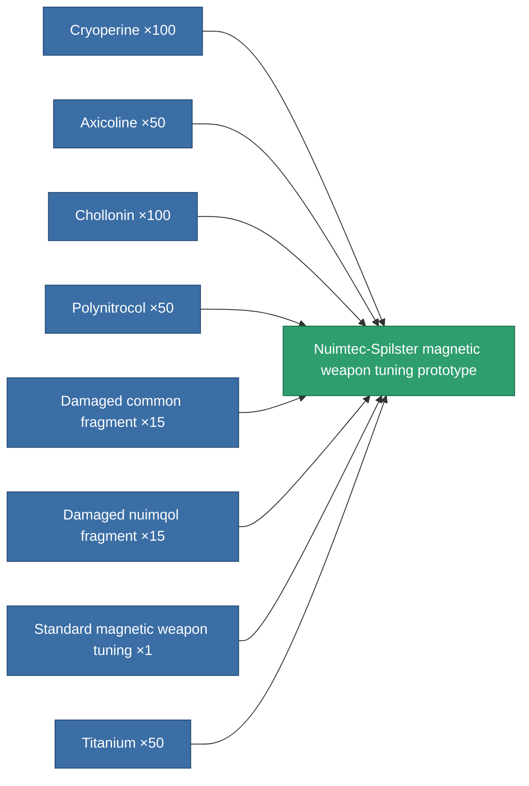

<!-- Generated by tools/generate from the live database (source: entitydefaults definition 2318, aggregatevalues via aggregatefields).
     Do not edit by hand; regenerate instead. -->

# Nuimtec-Spilster magnetic weapon tuning prototype

|  |  |
|---|---|
| Definition | `def_named1_damage_mod_railgun_pr` |
| Tier | T2 (prototype) |
| Health | 100 |
| Volume | 0.5 |
| Mass | 75 |
| Category | Modules / Weapons |
| Tier line | [Standard magnetic weapon tuning](/content/items/standard-damage-mod-railgun/) (T1) → [Nuimtec-Spilster magnetic weapon tuning](/content/items/named1-damage-mod-railgun/) (T2) → **Nuimtec-Spilster magnetic weapon tuning prototype** (T2) → [RSU-Magnitcore magnetic weapon tuning](/content/items/named2-damage-mod-railgun/) (T3) → [Nuimtec-Magniscope XM80 magnetic weapon tuning](/content/items/named3-damage-mod-railgun/) (T4) |

## Stats

| Field | Value |
|---|---|
| cpu_usage | 22 |
| damage_railgun_modifier | 0.15 |
| powergrid_usage | 4 |

<!-- production:generated -->
## Production

**Produced from 8 components, research level 4** — assemble the components to build it (see [Recipes](/content/recipes/) for the full list):

[All items](/content/items/)
