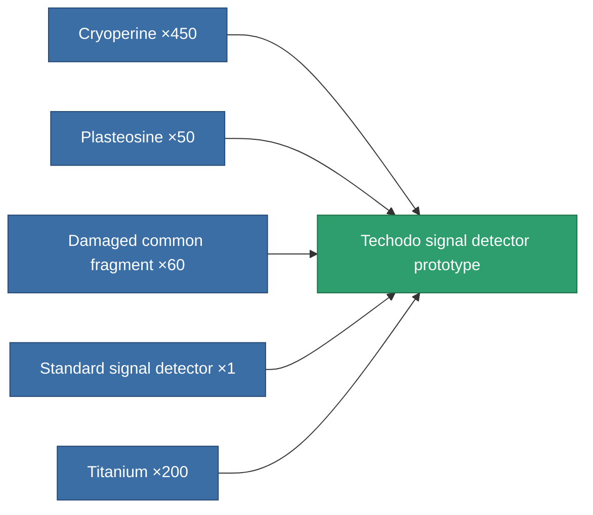

<!-- Generated by tools/generate from the live database (source: entitydefaults definition 2923, aggregatevalues via aggregatefields).
     Do not edit by hand; regenerate instead. -->

# Techodo signal detector prototype

|  |  |
|---|---|
| Definition | `def_named1_detection_modul_pr` |
| Tier | 2 |
| Health | 100 |
| Volume | 0.5 |
| Mass | 187.5 |
| Category | Modules / Enhancements |

## Stats

| Field | Value |
|---|---|
| core_usage | 144 |
| cpu_usage | 70 |
| cycle_time | 25k |
| effect_detection_strength_modifier | 20 |
| effect_stealth_strength_modifier | -20 |
| powergrid_usage | 5 |

<!-- production:generated -->
## Production

**Produced from 5 components, research level 7** — assemble the components to build it (see [Recipes](/content/recipes/) for the full list):

[All items](/content/items/)
