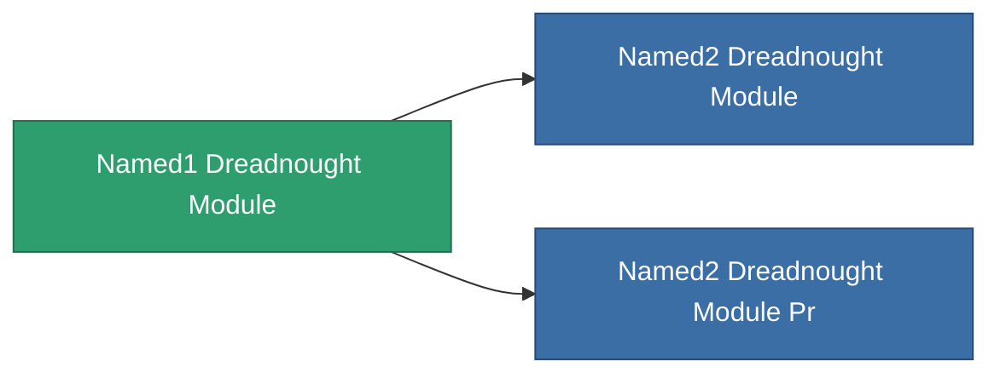

<!-- Generated by tools/generate from the live database (source: entitydefaults definition 8801, aggregatevalues via aggregatefields).
     Do not edit by hand; regenerate instead. -->

# Named1 Dreadnought Module

|  |  |
|---|---|
| Definition | `def_named1_dreadnought_module` |
| Tier | 2 |
| Health | 100 |
| Volume | 2.5 |
| Mass | 1500 |
| Category | Modules / Enhancements |

## Stats

| Field | Value |
|---|---|
| core_usage | 135 |
| cpu_usage | 432 |
| cycle_time | 180k |
| effect_dreadnought_blob_emission_modifier | 2 |
| effect_dreadnought_detection_strength_modifier | 150 |
| effect_dreadnought_optimal_range_modifier | 1.6 |
| effect_dreadnought_stealth_strength_modifier | -30 |
| effect_dreadnought_weapon_cycle_time_modifier | 0.9 |
| effect_dreadnought_weapon_damage_modifier | 1.3 |
| powergrid_usage | 1.215k |

<!-- production:generated -->
## Production

**Component of 2 items** — everything that uses it in production:

[All items](/content/items/)
