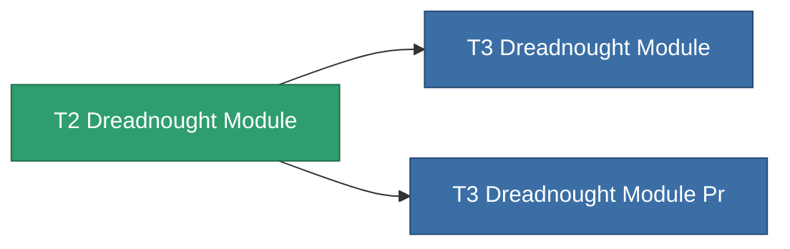

<!-- Generated by tools/generate from the live database (source: entitydefaults definition 8801, aggregatevalues via aggregatefields).
     Do not edit by hand; regenerate instead. -->

# T2 Dreadnought Module

|  |  |
|---|---|
| Definition | `def_named1_dreadnought_module` |
| Tier | T2 |
| Health | 100 |
| Volume | 2.5 |
| Mass | 1500 |
| Category | Modules / Enhancements |
| Tier line | [Standard Dreadnought Module](/content/items/standard-dreadnought-module/) (T1) → **T2 Dreadnought Module** (T2) → [T3 Dreadnought Module](/content/items/named2-dreadnought-module/) (T3) → [T4 Dreadnought Module](/content/items/named3-dreadnought-module/) (T4) |

## Stats

| Field | Value |
|---|---|
| core_usage | 135 |
| cpu_usage | 432 |
| cycle_time | 180k |
| effect_dreadnought_blob_emission_modifier | 2 |
| effect_dreadnought_detection_strength_modifier | 150 |
| effect_dreadnought_optimal_range_modifier | 1.6 |
| effect_dreadnought_stealth_strength_modifier | -30 |
| effect_dreadnought_weapon_cycle_time_modifier | 0.9 |
| effect_dreadnought_weapon_damage_modifier | 1.3 |
| powergrid_usage | 1.215k |

<!-- production:generated -->
## Production

**Produced from 4 components** — assemble the components to build it (see [Recipes](/content/recipes/) for the full list):

<svg class="prod-card-icon" aria-hidden="true"><use href="#mi-grid"/></svg><a class="prod-card-name" href="/content/items/axicol/">Cryoperine</a>

required: <b>600</b>

<svg class="prod-card-icon" aria-hidden="true"><use href="#mi-crystal"/></svg><a class="prod-card-name" href="/content/items/robotshard-common-basic/">Damaged common fragment</a>

required: <b>120</b>

<svg class="prod-card-icon" aria-hidden="true"><use href="#mi-panel"/></svg><a class="prod-card-name" href="/content/items/standard-dreadnought-module/">Standard Dreadnought Module</a>

required: <b>1</b>

<svg class="prod-card-icon" aria-hidden="true"><use href="#mi-grid"/></svg><a class="prod-card-name" href="/content/items/titanium/">Titanium</a>

required: <b>2.4k</b>

## Used in production

**Component of 2 items** — everything that uses it in production:

