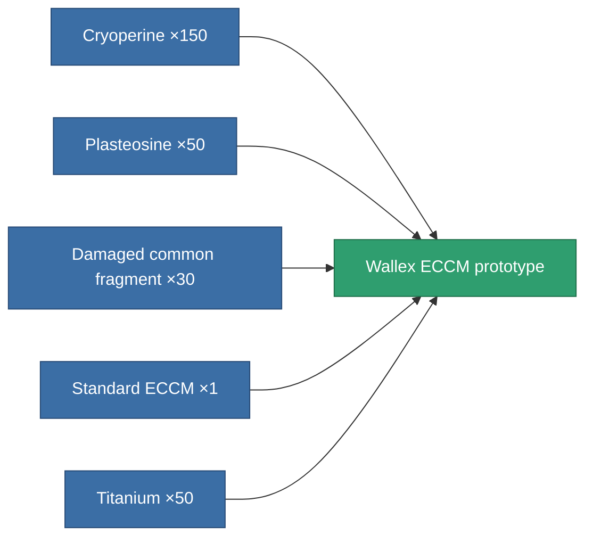

<!-- Generated by tools/generate from the live database (source: entitydefaults definition 2264, aggregatevalues via aggregatefields).
     Do not edit by hand; regenerate instead. -->

# Wallex ECCM prototype

|  |  |
|---|---|
| Definition | `def_named1_eccm_pr` |
| Tier | T2 (prototype) |
| Health | 100 |
| Volume | 0.5 |
| Mass | 67.5 |
| Category | Modules / Enhancements |
| Tier line | [Standard ECCM](/content/items/standard-eccm/) (T1) → [Wallex ECCM](/content/items/named1-eccm/) (T2) → **Wallex ECCM prototype** (T2) → [Deshrud-QW ECCM](/content/items/named2-eccm/) (T3) → [Braviar ECCM](/content/items/named3-eccm/) (T4) |

## Stats

| Field | Value |
|---|---|
| cpu_usage | 20 |
| powergrid_usage | 13 |
| sensor_strength | 52.5 |

<!-- production:generated -->
## Production

**Produced from 5 components, research level 3** — assemble the components to build it (see [Recipes](/content/recipes/) for the full list):

[All items](/content/items/)
