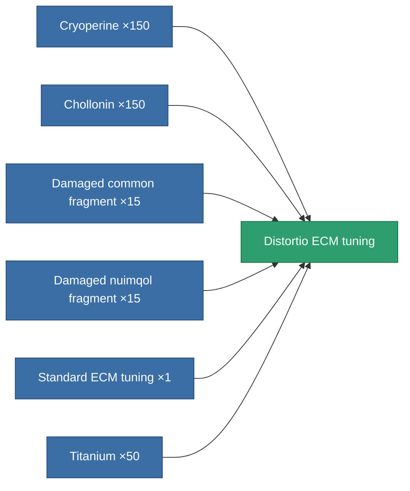
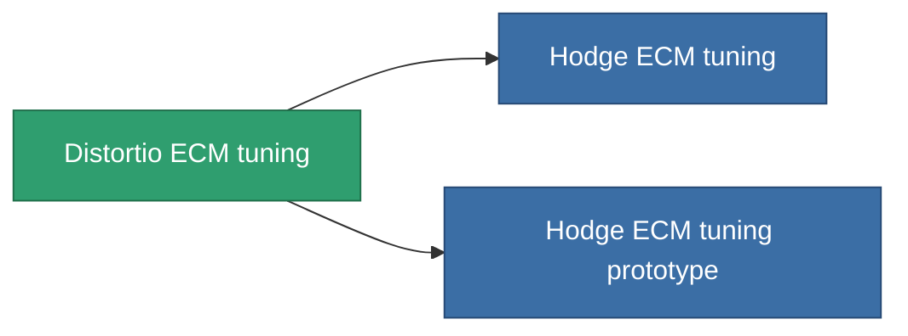

<!-- Generated by tools/generate from the live database (source: entitydefaults definition 4587, aggregatevalues via aggregatefields).
     Do not edit by hand; regenerate instead. -->

# Distortio ECM tuning

|  |  |
|---|---|
| Definition | `def_named1_ecm_booster` |
| Tier | T2 |
| Health | 100 |
| Volume | 0.5 |
| Mass | 135 |
| Category | Modules / Enhancements |
| Tier line | [Standard ECM tuning](/content/items/standard-ecm-booster/) (T1) → **Distortio ECM tuning** (T2) → [Hodge ECM tuning](/content/items/named2-ecm-booster/) (T3) → [Sludge ECM tuning](/content/items/named3-ecm-booster/) (T4) |

## Stats

| Field | Value |
|---|---|
| core_usage_sensor_jammer_modifier | 1.1 |
| cpu_usage | 57 |
| ecm_strength_modifier | 1.25 |
| powergrid_usage | 22 |

<!-- production:generated -->
## Production

**Produced from 6 components, research level 6** — assemble the components to build it (see [Recipes](/content/recipes/) for the full list):

## Used in production

**Component of 2 items** — everything that uses it in production:

[All items](/content/items/)
