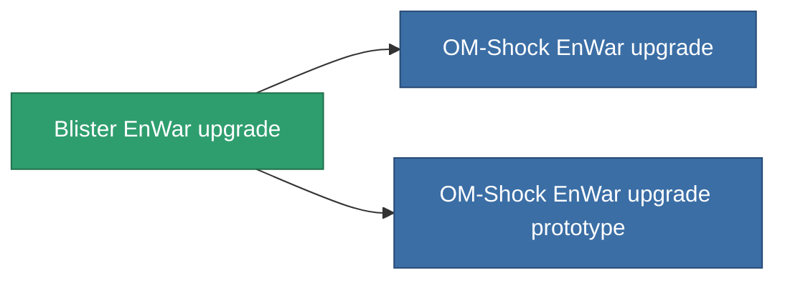

<!-- Generated by tools/generate from the live database (source: entitydefaults definition 4583, aggregatevalues via aggregatefields).
     Do not edit by hand; regenerate instead. -->

# Blister EnWar upgrade

|  |  |
|---|---|
| Definition | `def_named1_energy_warfare_upgrade` |
| Tier | T2 |
| Health | 100 |
| Volume | 1 |
| Mass | 225 |
| Category | Modules / Enhancements |
| Tier line | [Standard EnWar upgrade](/content/items/standard-energy-warfare-upgrade/) (T1) → **Blister EnWar upgrade** (T2) → [OM-Shock EnWar upgrade](/content/items/named2-energy-warfare-upgrade/) (T3) → [XT-Shock EnWar upgrade](/content/items/named3-energy-warfare-upgrade/) (T4) |

## Stats

| Field | Value |
|---|---|
| core_usage_energy_neutralizers_modifier | 1.1 |
| cpu_usage | 23 |
| energy_neutralized_amount_modifier | 1.2 |
| energy_vampired_amount_modifier | 1.1 |
| powergrid_usage | 41 |

<!-- production:generated -->
## Production

**Produced from 8 components, research level 6** — assemble the components to build it (see [Recipes](/content/recipes/) for the full list):

<svg class="prod-card-icon" aria-hidden="true"><use href="#mi-grid"/></svg><a class="prod-card-name" href="/content/items/axicol/">Cryoperine</a>

required: <b>150</b>

<svg class="prod-card-icon" aria-hidden="true"><use href="#mi-grid"/></svg><a class="prod-card-name" href="/content/items/axicoline/">Axicoline</a>

required: <b>50</b>

<svg class="prod-card-icon" aria-hidden="true"><use href="#mi-grid"/></svg><a class="prod-card-name" href="/content/items/phlobotil/">Phlobotil</a>

required: <b>50</b>

<svg class="prod-card-icon" aria-hidden="true"><use href="#mi-crystal"/></svg><a class="prod-card-name" href="/content/items/robotshard-common-basic/">Damaged common fragment</a>

required: <b>15</b>

<svg class="prod-card-icon" aria-hidden="true"><use href="#mi-crystal"/></svg><a class="prod-card-name" href="/content/items/robotshard-pelistal-basic/">Damaged pelistal fragment</a>

required: <b>15</b>

<svg class="prod-card-icon" aria-hidden="true"><use href="#mi-grid"/></svg><a class="prod-card-name" href="/content/items/standard-energy-warfare-upgrade/">Standard EnWar upgrade</a>

required: <b>1</b>

<svg class="prod-card-icon" aria-hidden="true"><use href="#mi-grid"/></svg><a class="prod-card-name" href="/content/items/titanium/">Titanium</a>

required: <b>50</b>

<svg class="prod-card-icon" aria-hidden="true"><use href="#mi-grid"/></svg><a class="prod-card-name" href="/content/items/vitricyl/">Vitricyl</a>

required: <b>150</b>

## Used in production

**Component of 2 items** — everything that uses it in production:

