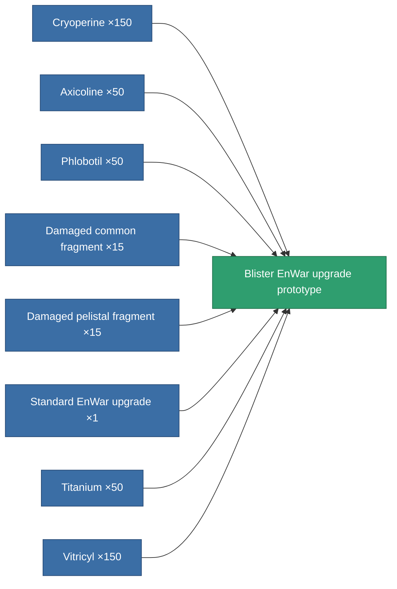

<!-- Generated by tools/generate from the live database (source: entitydefaults definition 5114, aggregatevalues via aggregatefields).
     Do not edit by hand; regenerate instead. -->

# Blister EnWar upgrade prototype

|  |  |
|---|---|
| Definition | `def_named1_energy_warfare_upgrade_pr` |
| Tier | T2 (prototype) |
| Health | 100 |
| Volume | 1 |
| Mass | 168.75 |
| Category | Modules / Enhancements |
| Tier line | [Standard EnWar upgrade](/content/items/standard-energy-warfare-upgrade/) (T1) → [Blister EnWar upgrade](/content/items/named1-energy-warfare-upgrade/) (T2) → **Blister EnWar upgrade prototype** (T2) → [OM-Shock EnWar upgrade](/content/items/named2-energy-warfare-upgrade/) (T3) → [XT-Shock EnWar upgrade](/content/items/named3-energy-warfare-upgrade/) (T4) |

## Stats

| Field | Value |
|---|---|
| core_usage_energy_neutralizers_modifier | 1.1 |
| cpu_usage | 21 |
| energy_neutralized_amount_modifier | 1.2 |
| energy_vampired_amount_modifier | 1.1 |
| powergrid_usage | 37 |

<!-- production:generated -->
## Production

**Produced from 8 components, research level 6** — assemble the components to build it (see [Recipes](/content/recipes/) for the full list):

[All items](/content/items/)
