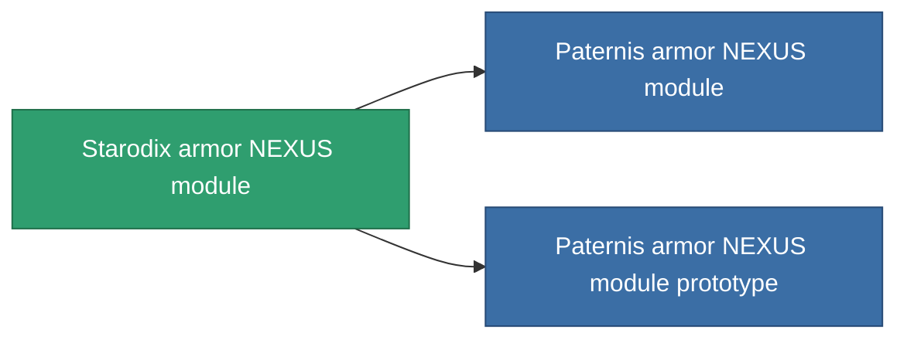

<!-- Generated by tools/generate from the live database (source: entitydefaults definition 2580, aggregatevalues via aggregatefields).
     Do not edit by hand; regenerate instead. -->

# Starodix armor NEXUS module

|  |  |
|---|---|
| Definition | `def_named1_gang_assist_defense_module` |
| Tier | 2 |
| Health | 100 |
| Volume | 0.2 |
| Mass | 10 |
| Category | Modules / Enhancements |
| Note | armor hp 1% /ext lvl |

## Stats

| Field | Value |
|---|---|
| core_usage | 31 |
| cpu_usage | 78 |
| cycle_time | 10k |
| default_effect_range | 100 |
| effect_armor_max_modifier | 1.02 |
| powergrid_usage | 31 |

<!-- production:generated -->
## Production

**Component of 2 items** — everything that uses it in production:

[All items](/content/items/)
