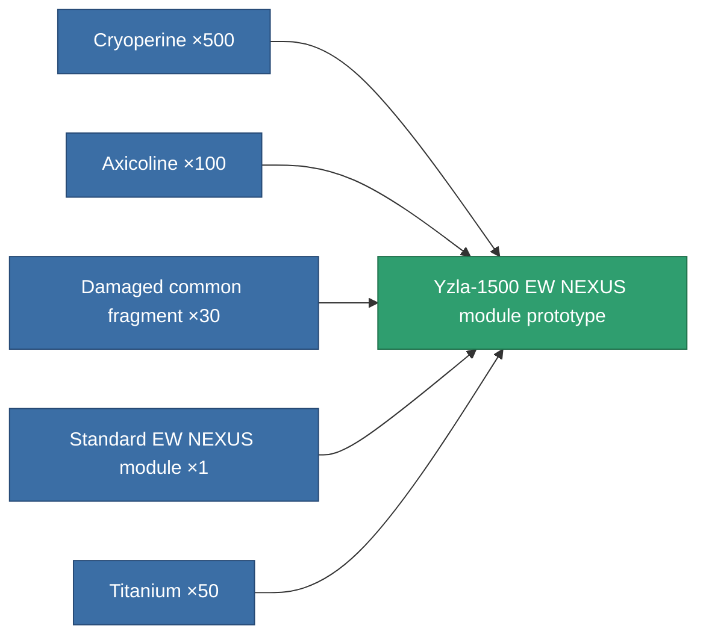

<!-- Generated by tools/generate from the live database (source: entitydefaults definition 2631, aggregatevalues via aggregatefields).
     Do not edit by hand; regenerate instead. -->

# Yzla-1500 EW NEXUS module prototype

|  |  |
|---|---|
| Definition | `def_named1_gang_assist_ewar_range_module_pr` |
| Tier | 2 |
| Health | 100 |
| Volume | 0.2 |
| Mass | 37.5 |
| Category | Modules / Enhancements |

## Stats

| Field | Value |
|---|---|
| core_usage | 28 |
| cpu_usage | 74 |
| cycle_time | 10k |
| default_effect_range | 100 |
| effect_enhancer_aura_radius_modifier | 1.2 |
| effect_ew_optimal_range_modifier | 1.02 |
| powergrid_usage | 29 |

<!-- production:generated -->
## Production

**Produced from 5 components, research level 5** — assemble the components to build it (see [Recipes](/content/recipes/) for the full list):

[All items](/content/items/)
