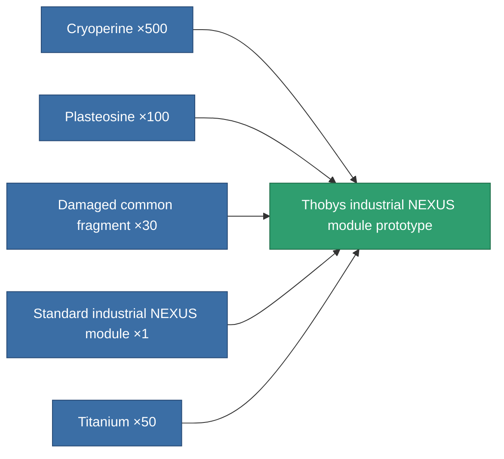

<!-- Generated by tools/generate from the live database (source: entitydefaults definition 2622, aggregatevalues via aggregatefields).
     Do not edit by hand; regenerate instead. -->

# Thobys industrial NEXUS module prototype

|  |  |
|---|---|
| Definition | `def_named1_gang_assist_industry_module_pr` |
| Tier | T2 (prototype) |
| Health | 100 |
| Volume | 0.2 |
| Mass | 7.5 |
| Category | Modules / Enhancements |
| Tier line | [Standard industrial NEXUS module](/content/items/standard-gang-assist-industry-module/) (T1) → [Thobys industrial NEXUS module](/content/items/named1-gang-assist-industry-module/) (T2) → **Thobys industrial NEXUS module prototype** (T2) → [EE-D220 industrial NEXUS module](/content/items/named2-gang-assist-industry-module/) (T3) → [Rypoa industrial NEXUS module](/content/items/named3-gang-assist-industry-module/) (T4) |

## Stats

| Field | Value |
|---|---|
| core_usage | 28 |
| cpu_usage | 74 |
| cycle_time | 10k |
| default_effect_range | 100 |
| effect_core_usage_gathering_modifier | 0.98 |
| effect_enhancer_aura_radius_modifier | 1.2 |
| powergrid_usage | 29 |

<!-- production:generated -->
## Production

**Produced from 5 components, research level 5** — assemble the components to build it (see [Recipes](/content/recipes/) for the full list):

[All items](/content/items/)
