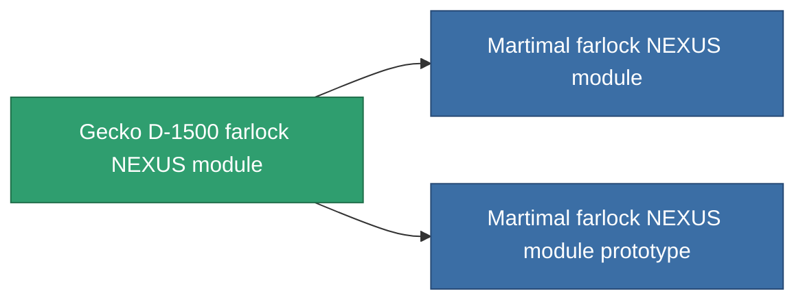

<!-- Generated by tools/generate from the live database (source: entitydefaults definition 2571, aggregatevalues via aggregatefields).
     Do not edit by hand; regenerate instead. -->

# Gecko D-1500 farlock NEXUS module

|  |  |
|---|---|
| Definition | `def_named1_gang_assist_information_module` |
| Tier | T2 |
| Health | 100 |
| Volume | 0.2 |
| Mass | 10 |
| Category | Modules / Enhancements |
| Tier line | [Standard farlock NEXUS module](/content/items/standard-gang-assist-information-module/) (T1) → **Gecko D-1500 farlock NEXUS module** (T2) → [Martimal farlock NEXUS module](/content/items/named2-gang-assist-information-module/) (T3) → [Gecko M-2000 farlock NEXUS module](/content/items/named3-gang-assist-information-module/) (T4) |
| Note | locking range 1.0%  /ext lvl |

## Stats

| Field | Value |
|---|---|
| core_usage | 31 |
| cpu_usage | 78 |
| cycle_time | 10k |
| default_effect_range | 100 |
| effect_locking_range_modifier | 1.02 |
| powergrid_usage | 31 |

<!-- production:generated -->
## Production

**Produced from 5 components, research level 5** — assemble the components to build it (see [Recipes](/content/recipes/) for the full list):

<svg class="prod-card-icon" aria-hidden="true"><use href="#mi-grid"/></svg><a class="prod-card-name" href="/content/items/axicol/">Cryoperine</a>

required: <b>300</b>

<svg class="prod-card-icon" aria-hidden="true"><use href="#mi-grid"/></svg><a class="prod-card-name" href="/content/items/prilumium/">Prilumium</a>

required: <b>300</b>

<svg class="prod-card-icon" aria-hidden="true"><use href="#mi-crystal"/></svg><a class="prod-card-name" href="/content/items/robotshard-common-basic/">Damaged common fragment</a>

required: <b>30</b>

<svg class="prod-card-icon" aria-hidden="true"><use href="#mi-panel"/></svg><a class="prod-card-name" href="/content/items/standard-gang-assist-information-module/">Standard farlock NEXUS module</a>

required: <b>1</b>

<svg class="prod-card-icon" aria-hidden="true"><use href="#mi-grid"/></svg><a class="prod-card-name" href="/content/items/titanium/">Titanium</a>

required: <b>50</b>

## Used in production

**Component of 2 items** — everything that uses it in production:

