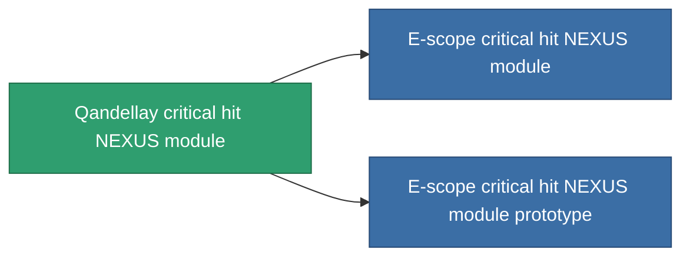

<!-- Generated by tools/generate from the live database (source: entitydefaults definition 2595, aggregatevalues via aggregatefields).
     Do not edit by hand; regenerate instead. -->

# Qandellay critical hit NEXUS module

|  |  |
|---|---|
| Definition | `def_named1_gang_assist_precision_firing_module` |
| Tier | T2 |
| Health | 100 |
| Volume | 0.2 |
| Mass | 50 |
| Category | Modules / Enhancements |
| Tier line | [Standard critical hit NEXUS module](/content/items/standard-gang-assist-precision-firing-module/) (T1) → **Qandellay critical hit NEXUS module** (T2) → [E-scope critical hit NEXUS module](/content/items/named2-gang-assist-precision-firing-module/) (T3) → [ZTW critical hit NEXUS module](/content/items/named3-gang-assist-precision-firing-module/) (T4) |
| Note | crit_chancet novel |

## Stats

| Field | Value |
|---|---|
| core_usage | 31 |
| cpu_usage | 78 |
| cycle_time | 10k |
| default_effect_range | 100 |
| effect_critical_hit_chance_modifier | 0.02 |
| powergrid_usage | 31 |

<!-- production:generated -->
## Production

**Produced from 8 components, research level 5** — assemble the components to build it (see [Recipes](/content/recipes/) for the full list):

<svg class="prod-card-icon" aria-hidden="true"><use href="#mi-grid"/></svg><a class="prod-card-name" href="/content/items/axicol/">Cryoperine</a>

required: <b>250</b>

<svg class="prod-card-icon" aria-hidden="true"><use href="#mi-grid"/></svg><a class="prod-card-name" href="/content/items/axicoline/">Axicoline</a>

required: <b>50</b>

<svg class="prod-card-icon" aria-hidden="true"><use href="#mi-grid"/></svg><a class="prod-card-name" href="/content/items/polynucleit/">Polynucleit</a>

required: <b>50</b>

<svg class="prod-card-icon" aria-hidden="true"><use href="#mi-grid"/></svg><a class="prod-card-name" href="/content/items/prilumium/">Prilumium</a>

required: <b>250</b>

<svg class="prod-card-icon" aria-hidden="true"><use href="#mi-crystal"/></svg><a class="prod-card-name" href="/content/items/robotshard-nuimqol-basic/">Damaged nuimqol fragment</a>

required: <b>15</b>

<svg class="prod-card-icon" aria-hidden="true"><use href="#mi-crystal"/></svg><a class="prod-card-name" href="/content/items/robotshard-thelodica-basic/">Damaged thelodica fragment</a>

required: <b>15</b>

<svg class="prod-card-icon" aria-hidden="true"><use href="#mi-panel"/></svg><a class="prod-card-name" href="/content/items/standard-gang-assist-precision-firing-module/">Standard critical hit NEXUS module</a>

required: <b>1</b>

<svg class="prod-card-icon" aria-hidden="true"><use href="#mi-grid"/></svg><a class="prod-card-name" href="/content/items/titanium/">Titanium</a>

required: <b>50</b>

## Used in production

**Component of 2 items** — everything that uses it in production:

