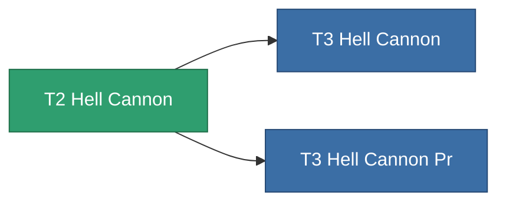

<!-- Generated by tools/generate from the live database (source: entitydefaults definition 846, aggregatevalues via aggregatefields).
     Do not edit by hand; regenerate instead. -->

# T2 Hell Cannon

|  |  |
|---|---|
| Definition | `def_named1_hell_cannon` |
| Tier | T2 |
| Health | 100 |
| Volume | 1.8 |
| Mass | 990 |
| Category | Modules / Weapons |
| Tier line | [Standard Hell Cannon](/content/items/standard-hell-cannon/) (T1) → **T2 Hell Cannon** (T2) → [T3 Hell Cannon](/content/items/named2-hell-cannon/) (T3) → [T4 Hell Cannon](/content/items/named3-hell-cannon/) (T4) |

## Stats

| Field | Value |
|---|---|
| accuracy | 44 |
| core_usage | 2 |
| cpu_usage | 49.5 |
| cycle_time | 8k |
| damage_modifier | 2.2 |
| falloff | 20 |
| optimal_range | 15 |
| powergrid_usage | 175.5 |

<!-- production:generated -->
## Production

**Produced from 7 components** — assemble the components to build it (see [Recipes](/content/recipes/) for the full list):

<svg class="prod-card-icon" aria-hidden="true"><use href="#mi-grid"/></svg><a class="prod-card-name" href="/content/items/alligior/">Alligior</a>

required: <b>100</b>

<svg class="prod-card-icon" aria-hidden="true"><use href="#mi-grid"/></svg><a class="prod-card-name" href="/content/items/biotichrin/">Biotichrin</a>

required: <b>100</b>

<svg class="prod-card-icon" aria-hidden="true"><use href="#mi-grid"/></svg><a class="prod-card-name" href="/content/items/espitium/">Espitium</a>

required: <b>50</b>

<svg class="prod-card-icon" aria-hidden="true"><use href="#mi-crystal"/></svg><a class="prod-card-name" href="/content/items/robotshard-common-basic/">Damaged common fragment</a>

required: <b>90</b>

<svg class="prod-card-icon" aria-hidden="true"><use href="#mi-grid"/></svg><a class="prod-card-name" href="/content/items/specimen-sap-item-flux/">Specimen Sap Item Flux</a>

required: <b>10</b>

<svg class="prod-card-icon" aria-hidden="true"><use href="#mi-robots"/></svg><a class="prod-card-name" href="/content/items/standard-hell-cannon/">Standard Hell Cannon</a>

required: <b>1</b>

<svg class="prod-card-icon" aria-hidden="true"><use href="#mi-grid"/></svg><a class="prod-card-name" href="/content/items/titanium/">Titanium</a>

required: <b>100</b>

## Used in production

**Component of 2 items** — everything that uses it in production:

