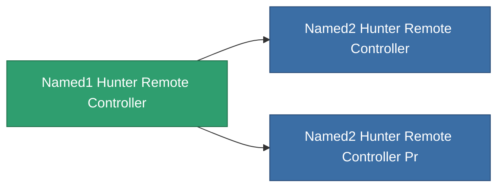

<!-- Generated by tools/generate from the live database (source: entitydefaults definition 8990, aggregatevalues via aggregatefields).
     Do not edit by hand; regenerate instead. -->

# Named1 Hunter Remote Controller

|  |  |
|---|---|
| Definition | `def_named1_hunter_remote_controller` |
| Tier | 2 |
| Health | 100 |
| Volume | 100 |
| Mass | 450 |
| Category | Modules / Remote control |
| Note | Deploys an autonomous hunter drone -- PvE ammo hunts Niani NPCs, PvP ammo hunts hostile-standing players. |

## Stats

| Field | Value |
|---|---|
| core_usage | 155 |
| cpu_usage | 260 |
| cycle_time | 4.5k |
| detection_range | 110 |
| powergrid_usage | 67 |
| remote_control_bandwidth_max | 1 |
| remote_control_lifetime | 1.98M |
| remote_control_operational_range | 165 |

<!-- production:generated -->
## Production

**Component of 2 items** — everything that uses it in production:

[All items](/content/items/)
