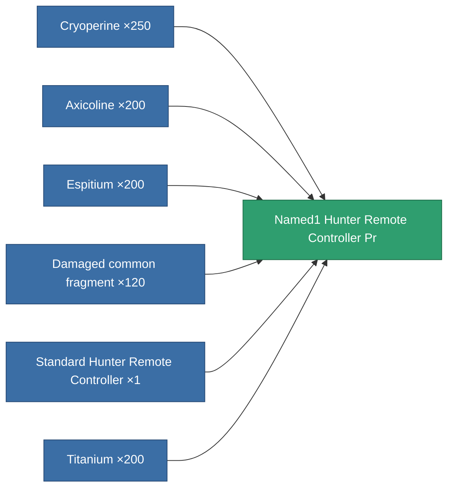

<!-- Generated by tools/generate from the live database (source: entitydefaults definition 8991, aggregatevalues via aggregatefields).
     Do not edit by hand; regenerate instead. -->

# Named1 Hunter Remote Controller Pr

|  |  |
|---|---|
| Definition | `def_named1_hunter_remote_controller_pr` |
| Tier | 2 |
| Health | 100 |
| Volume | 100 |
| Mass | 400 |
| Category | Modules / Remote control |
| Note | Deploys an autonomous hunter drone -- PvE ammo hunts Niani NPCs, PvP ammo hunts hostile-standing players. |

## Stats

| Field | Value |
|---|---|
| core_usage | 155 |
| cpu_usage | 255 |
| cycle_time | 4.5k |
| detection_range | 110 |
| powergrid_usage | 66 |
| remote_control_bandwidth_max | 1 |
| remote_control_lifetime | 2.16M |
| remote_control_operational_range | 180 |

<!-- production:generated -->
## Production

**Produced from 6 components, research level 6** — assemble the components to build it (see [Recipes](/content/recipes/) for the full list):

[All items](/content/items/)
