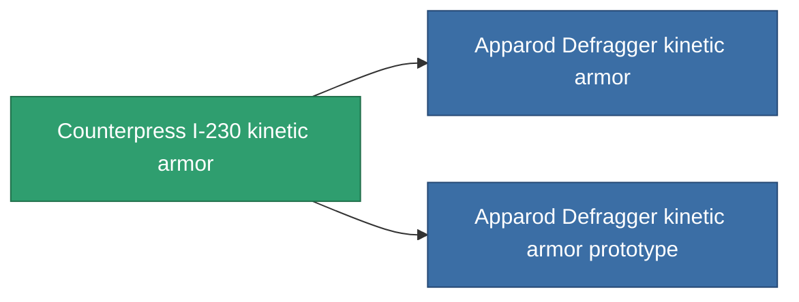

<!-- Generated by tools/generate from the live database (source: entitydefaults definition 713, aggregatevalues via aggregatefields).
     Do not edit by hand; regenerate instead. -->

# Counterpress I-230 kinetic armor

|  |  |
|---|---|
| Definition | `def_named1_kin_armor_hardener` |
| Tier | T2 |
| Health | 100 |
| Volume | 1 |
| Mass | 90 |
| Category | Modules / Armor |
| Tier line | [Standard kinetic armor](/content/items/standard-kin-armor-hardener/) (T1) → **Counterpress I-230 kinetic armor** (T2) → [Apparod Defragger kinetic armor](/content/items/named2-kin-armor-hardener/) (T3) → [Grampier-VK kinetic armor](/content/items/named3-kin-armor-hardener/) (T4) |

## Stats

| Field | Value |
|---|---|
| core_usage | 11 |
| cpu_usage | 22 |
| cycle_time | 10k |
| effect_resist_kinetic | 100 |
| powergrid_usage | 4 |
| resist_kinetic | 25 |

<!-- production:generated -->
## Production

**Produced from 8 components, research level 4** — assemble the components to build it (see [Recipes](/content/recipes/) for the full list):

<svg class="prod-card-icon" aria-hidden="true"><use href="#mi-grid"/></svg><a class="prod-card-name" href="/content/items/axicol/">Cryoperine</a>

required: <b>50</b>

<svg class="prod-card-icon" aria-hidden="true"><use href="#mi-grid"/></svg><a class="prod-card-name" href="/content/items/metachropin/">Metachropin</a>

required: <b>125</b>

<svg class="prod-card-icon" aria-hidden="true"><use href="#mi-grid"/></svg><a class="prod-card-name" href="/content/items/plasteosine/">Plasteosine</a>

required: <b>125</b>

<svg class="prod-card-icon" aria-hidden="true"><use href="#mi-grid"/></svg><a class="prod-card-name" href="/content/items/prilumium/">Prilumium</a>

required: <b>50</b>

<svg class="prod-card-icon" aria-hidden="true"><use href="#mi-crystal"/></svg><a class="prod-card-name" href="/content/items/robotshard-common-basic/">Damaged common fragment</a>

required: <b>15</b>

<svg class="prod-card-icon" aria-hidden="true"><use href="#mi-crystal"/></svg><a class="prod-card-name" href="/content/items/robotshard-pelistal-basic/">Damaged pelistal fragment</a>

required: <b>15</b>

<svg class="prod-card-icon" aria-hidden="true"><use href="#mi-tree"/></svg><a class="prod-card-name" href="/content/items/standard-kin-armor-hardener/">Standard kinetic armor</a>

required: <b>1</b>

<svg class="prod-card-icon" aria-hidden="true"><use href="#mi-grid"/></svg><a class="prod-card-name" href="/content/items/titanium/">Titanium</a>

required: <b>100</b>

## Used in production

**Component of 2 items** — everything that uses it in production:

