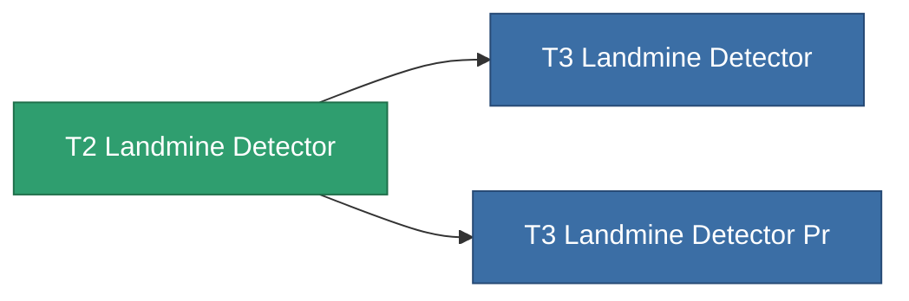

<!-- Generated by tools/generate from the live database (source: entitydefaults definition 8314, aggregatevalues via aggregatefields).
     Do not edit by hand; regenerate instead. -->

# T2 Landmine Detector

|  |  |
|---|---|
| Definition | `def_named1_landmine_detector` |
| Tier | T2 |
| Health | 100 |
| Volume | 1.5 |
| Mass | 900 |
| Category | Modules / Enhancements |
| Tier line | **T2 Landmine Detector** (T2) → [T3 Landmine Detector](/content/items/named2-landmine-detector/) (T3) → [T4 Landmine Detector](/content/items/named3-landmine-detector/) (T4) |

## Stats

| Field | Value |
|---|---|
| core_usage | 14 |
| cpu_usage | 18 |
| cycle_time | 10k |
| effect_mine_detection_range_modifier | 1.3 |
| powergrid_usage | 6 |

<!-- production:generated -->
## Production

**Produced from 4 components** — assemble the components to build it (see [Recipes](/content/recipes/) for the full list):

<svg class="prod-card-icon" aria-hidden="true"><use href="#mi-grid"/></svg><a class="prod-card-name" href="/content/items/axicol/">Cryoperine</a>

required: <b>400</b>

<svg class="prod-card-icon" aria-hidden="true"><use href="#mi-crystal"/></svg><a class="prod-card-name" href="/content/items/robotshard-common-basic/">Damaged common fragment</a>

required: <b>30</b>

<svg class="prod-card-icon" aria-hidden="true"><use href="#mi-grid"/></svg><a class="prod-card-name" href="/content/items/standart-landmine-detector/">Standart Landmine Detector</a>

required: <b>1</b>

<svg class="prod-card-icon" aria-hidden="true"><use href="#mi-grid"/></svg><a class="prod-card-name" href="/content/items/titanium/">Titanium</a>

required: <b>100</b>

## Used in production

**Component of 2 items** — everything that uses it in production:

