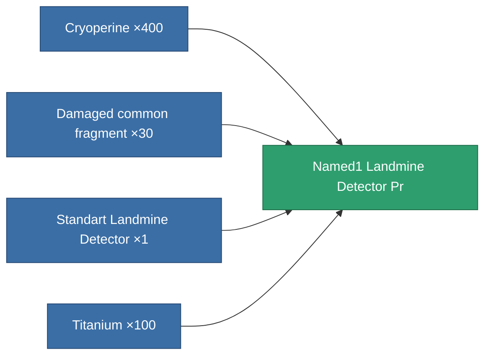

<!-- Generated by tools/generate from the live database (source: entitydefaults definition 8315, aggregatevalues via aggregatefields).
     Do not edit by hand; regenerate instead. -->

# Named1 Landmine Detector Pr

|  |  |
|---|---|
| Definition | `def_named1_landmine_detector_pr` |
| Tier | T2 (prototype) |
| Health | 100 |
| Volume | 1.5 |
| Mass | 800 |
| Category | Modules / Enhancements |
| Tier line | [Named1 Landmine Detector](/content/items/named1-landmine-detector/) (T2) → **Named1 Landmine Detector Pr** (T2) → [Named2 Landmine Detector](/content/items/named2-landmine-detector/) (T3) → [Named3 Landmine Detector](/content/items/named3-landmine-detector/) (T4) |

## Stats

| Field | Value |
|---|---|
| core_usage | 12 |
| cpu_usage | 17 |
| cycle_time | 10k |
| effect_mine_detection_range_modifier | 1.3 |
| powergrid_usage | 6 |

<!-- production:generated -->
## Production

**Produced from 4 components, research level 7** — assemble the components to build it (see [Recipes](/content/recipes/) for the full list):

[All items](/content/items/)
