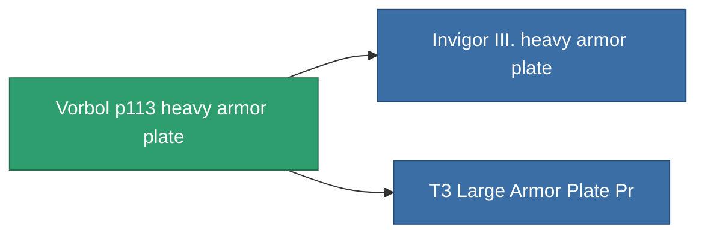

<!-- Generated by tools/generate from the live database (source: entitydefaults definition 690, aggregatevalues via aggregatefields).
     Do not edit by hand; regenerate instead. -->

# Vorbol p113 heavy armor plate

|  |  |
|---|---|
| Definition | `def_named1_large_armor_plate` |
| Tier | T2 |
| Health | 100 |
| Volume | 4 |
| Mass | 7200 |
| Category | Modules / Armor |
| Tier line | [Standard large armor plate](/content/items/standard-large-armor-plate/) (T1) → **Vorbol p113 heavy armor plate** (T2) → [Invigor III. heavy armor plate](/content/items/named2-large-armor-plate/) (T3) → [Halc heavy armor plate](/content/items/named3-large-armor-plate/) (T4) |

## Stats

| Field | Value |
|---|---|
| armor_max | 4.05k |
| cpu_usage | 60 |
| massiveness | 0.144 |
| powergrid_usage | 840 |
| signature_radius | 3 |

<!-- production:generated -->
## Production

**Produced from 5 components** — assemble the components to build it (see [Recipes](/content/recipes/) for the full list):

<svg class="prod-card-icon" aria-hidden="true"><use href="#mi-grid"/></svg><a class="prod-card-name" href="/content/items/plasteosine/">Plasteosine</a>

required: <b>1.1k</b>

<svg class="prod-card-icon" aria-hidden="true"><use href="#mi-crystal"/></svg><a class="prod-card-name" href="/content/items/robotshard-common-basic/">Damaged common fragment</a>

required: <b>90</b>

<svg class="prod-card-icon" aria-hidden="true"><use href="#mi-grid"/></svg><a class="prod-card-name" href="/content/items/specimen-sap-item-flux/">Specimen Sap Item Flux</a>

required: <b>15</b>

<svg class="prod-card-icon" aria-hidden="true"><use href="#mi-tree"/></svg><a class="prod-card-name" href="/content/items/standard-large-armor-plate/">Standard large armor plate</a>

required: <b>1</b>

<svg class="prod-card-icon" aria-hidden="true"><use href="#mi-grid"/></svg><a class="prod-card-name" href="/content/items/titanium/">Titanium</a>

required: <b>750</b>

## Used in production

**Component of 2 items** — everything that uses it in production:

