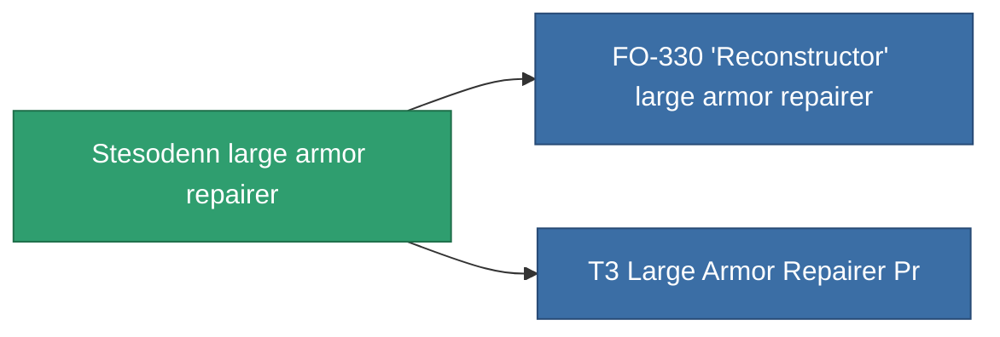

<!-- Generated by tools/generate from the live database (source: entitydefaults definition 699, aggregatevalues via aggregatefields).
     Do not edit by hand; regenerate instead. -->

# Stesodenn large armor repairer

|  |  |
|---|---|
| Definition | `def_named1_large_armor_repairer` |
| Tier | T2 |
| Health | 100 |
| Volume | 3 |
| Mass | 1350 |
| Category | Modules / Repair |
| Tier line | [Standard large armor repairer](/content/items/standard-large-armor-repairer/) (T1) → **Stesodenn large armor repairer** (T2) → [FO-330 'Reconstructor' large armor repairer](/content/items/named2-large-armor-repairer/) (T3) → [Pandegris large armor repairer](/content/items/named3-large-armor-repairer/) (T4) |

## Stats

| Field | Value |
|---|---|
| armor_repair_amount | 360 |
| core_usage | 362 |
| cpu_usage | 360 |
| cycle_time | 15k |
| powergrid_usage | 900 |

<!-- production:generated -->
## Production

**Produced from 8 components** — assemble the components to build it (see [Recipes](/content/recipes/) for the full list):

<svg class="prod-card-icon" aria-hidden="true"><use href="#mi-grid"/></svg><a class="prod-card-name" href="/content/items/axicol/">Cryoperine</a>

required: <b>75</b>

<svg class="prod-card-icon" aria-hidden="true"><use href="#mi-grid"/></svg><a class="prod-card-name" href="/content/items/chollonin/">Chollonin</a>

required: <b>75</b>

<svg class="prod-card-icon" aria-hidden="true"><use href="#mi-grid"/></svg><a class="prod-card-name" href="/content/items/plasteosine/">Plasteosine</a>

required: <b>300</b>

<svg class="prod-card-icon" aria-hidden="true"><use href="#mi-crystal"/></svg><a class="prod-card-name" href="/content/items/robotshard-common-basic/">Damaged common fragment</a>

required: <b>90</b>

<svg class="prod-card-icon" aria-hidden="true"><use href="#mi-grid"/></svg><a class="prod-card-name" href="/content/items/specimen-sap-item-flux/">Specimen Sap Item Flux</a>

required: <b>10</b>

<svg class="prod-card-icon" aria-hidden="true"><use href="#mi-tree"/></svg><a class="prod-card-name" href="/content/items/standard-large-armor-repairer/">Standard large armor repairer</a>

required: <b>1</b>

<svg class="prod-card-icon" aria-hidden="true"><use href="#mi-grid"/></svg><a class="prod-card-name" href="/content/items/statichnol/">Statichnol</a>

required: <b>300</b>

<svg class="prod-card-icon" aria-hidden="true"><use href="#mi-grid"/></svg><a class="prod-card-name" href="/content/items/titanium/">Titanium</a>

required: <b>150</b>

## Used in production

**Component of 2 items** — everything that uses it in production:

