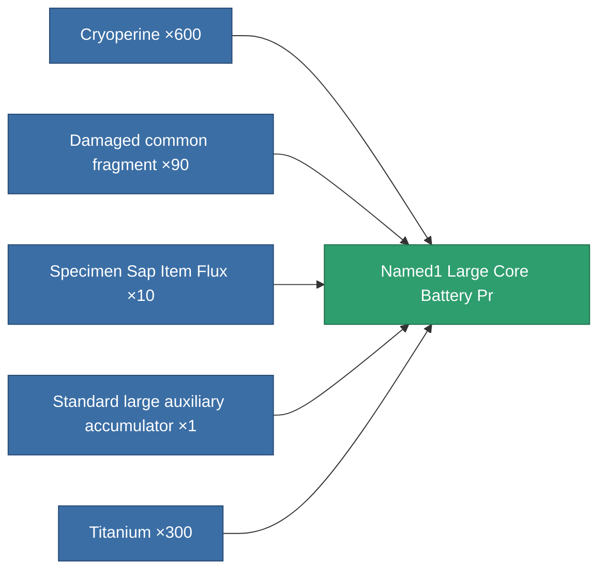

<!-- Generated by tools/generate from the live database (source: entitydefaults definition 5775, aggregatevalues via aggregatefields).
     Do not edit by hand; regenerate instead. -->

# Named1 Large Core Battery Pr

|  |  |
|---|---|
| Definition | `def_named1_large_core_battery_pr` |
| Tier | T2 (prototype) |
| Health | 100 |
| Volume | 3 |
| Mass | 2700 |
| Category | Modules / Power |
| Tier line | [Standard large auxiliary accumulator](/content/items/standard-large-core-battery/) (T1) → [Ovostec-gxc9000 large auxiliary accumulator](/content/items/named1-large-core-battery/) (T2) → **Named1 Large Core Battery Pr** (T2) → [Nibott-I large auxiliary accumulator](/content/items/named2-large-core-battery/) (T3) → [Pheter Charge-L large auxiliary accumulator](/content/items/named3-large-core-battery/) (T4) |
| Note | large module |

## Stats

| Field | Value |
|---|---|
| core_max | 1.125k |
| cpu_usage | 360 |
| powergrid_usage | 800 |

<!-- production:generated -->
## Production

**Produced from 5 components, research level 6** — assemble the components to build it (see [Recipes](/content/recipes/) for the full list):

[All items](/content/items/)
