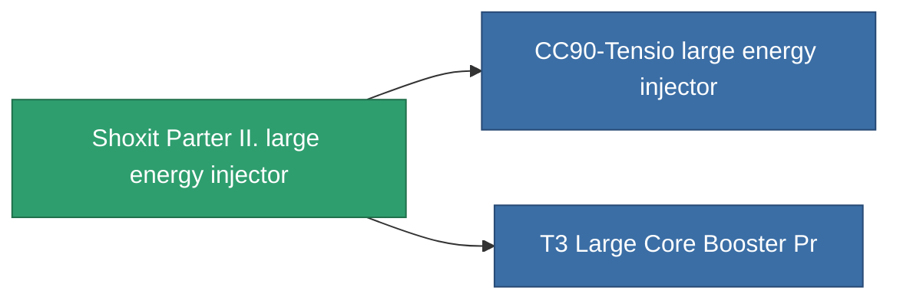

<!-- Generated by tools/generate from the live database (source: entitydefaults definition 828, aggregatevalues via aggregatefields).
     Do not edit by hand; regenerate instead. -->

# Shoxit Parter II. large energy injector

|  |  |
|---|---|
| Definition | `def_named1_large_core_booster` |
| Tier | T2 |
| Health | 100 |
| Volume | 2 |
| Mass | 1440 |
| Category | Modules / Enhancements |
| Tier line | [Standard large energy injector](/content/items/standard-large-core-booster/) (T1) → **Shoxit Parter II. large energy injector** (T2) → [CC90-Tensio large energy injector](/content/items/named2-large-core-booster/) (T3) → [Rymur DTTO large energy injector](/content/items/named3-large-core-booster/) (T4) |

## Stats

| Field | Value |
|---|---|
| core_usage | 0 |
| cpu_usage | 345 |
| cycle_time | 6.05k |
| powergrid_usage | 1.125k |

<!-- production:generated -->
## Production

**Produced from 5 components** — assemble the components to build it (see [Recipes](/content/recipes/) for the full list):

<svg class="prod-card-icon" aria-hidden="true"><use href="#mi-grid"/></svg><a class="prod-card-name" href="/content/items/axicol/">Cryoperine</a>

required: <b>600</b>

<svg class="prod-card-icon" aria-hidden="true"><use href="#mi-crystal"/></svg><a class="prod-card-name" href="/content/items/robotshard-common-basic/">Damaged common fragment</a>

required: <b>90</b>

<svg class="prod-card-icon" aria-hidden="true"><use href="#mi-grid"/></svg><a class="prod-card-name" href="/content/items/specimen-sap-item-flux/">Specimen Sap Item Flux</a>

required: <b>5</b>

<svg class="prod-card-icon" aria-hidden="true"><use href="#mi-grid"/></svg><a class="prod-card-name" href="/content/items/standard-large-core-booster/">Standard large energy injector</a>

required: <b>1</b>

<svg class="prod-card-icon" aria-hidden="true"><use href="#mi-grid"/></svg><a class="prod-card-name" href="/content/items/titanium/">Titanium</a>

required: <b>300</b>

## Used in production

**Component of 2 items** — everything that uses it in production:

