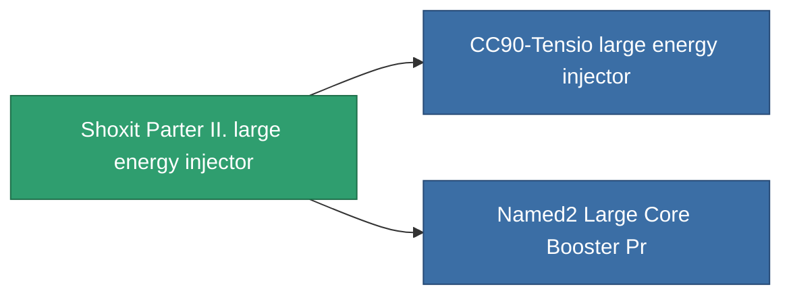

<!-- Generated by tools/generate from the live database (source: entitydefaults definition 828, aggregatevalues via aggregatefields).
     Do not edit by hand; regenerate instead. -->

# Shoxit Parter II. large energy injector

|  |  |
|---|---|
| Definition | `def_named1_large_core_booster` |
| Tier | 2 |
| Health | 100 |
| Volume | 2 |
| Mass | 1440 |
| Category | Modules / Enhancements |

## Stats

| Field | Value |
|---|---|
| core_usage | 0 |
| cpu_usage | 345 |
| cycle_time | 6.05k |
| powergrid_usage | 1.125k |

<!-- production:generated -->
## Production

**Component of 2 items** — everything that uses it in production:

[All items](/content/items/)
