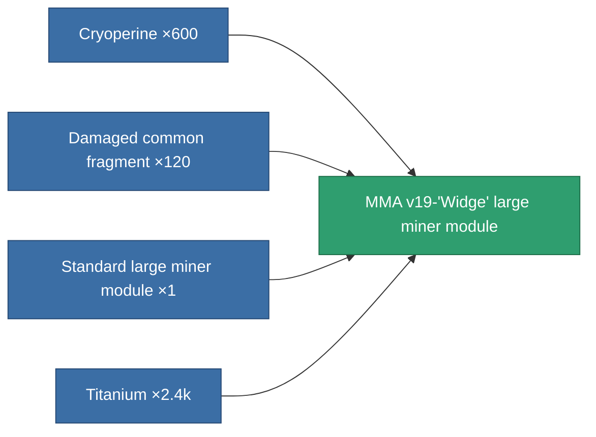
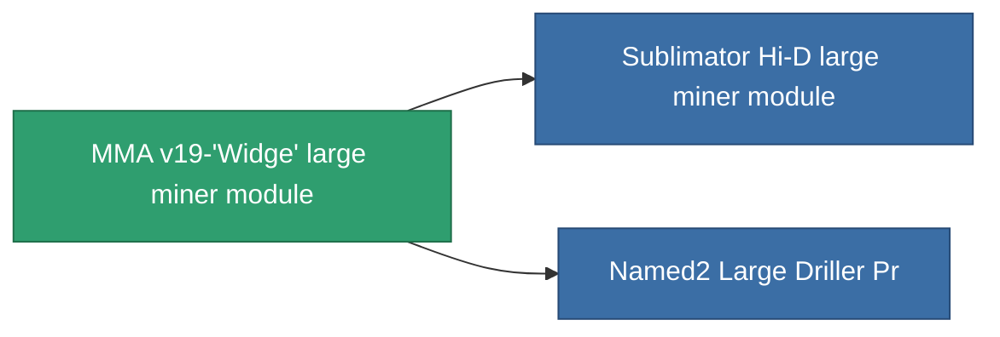

<!-- Generated by tools/generate from the live database (source: entitydefaults definition 8680, aggregatevalues via aggregatefields).
     Do not edit by hand; regenerate instead. -->

# MMA v19-'Widge' large miner module

|  |  |
|---|---|
| Definition | `def_named1_large_driller` |
| Tier | T2 |
| Health | 100 |
| Volume | 2.5 |
| Mass | 1500 |
| Category | Modules / Enhancements |
| Tier line | [Standard large miner module](/content/items/standard-large-driller/) (T1) → **MMA v19-'Widge' large miner module** (T2) → [Sublimator Hi-D large miner module](/content/items/named2-large-driller/) (T3) → [Pellex large miner module](/content/items/named3-large-driller/) (T4) |

## Stats

| Field | Value |
|---|---|
| core_usage | 135 |
| cpu_usage | 432 |
| cycle_time | 12k |
| powergrid_usage | 1.215k |

<!-- production:generated -->
## Production

**Produced from 4 components** — assemble the components to build it (see [Recipes](/content/recipes/) for the full list):

## Used in production

**Component of 2 items** — everything that uses it in production:

[All items](/content/items/)
