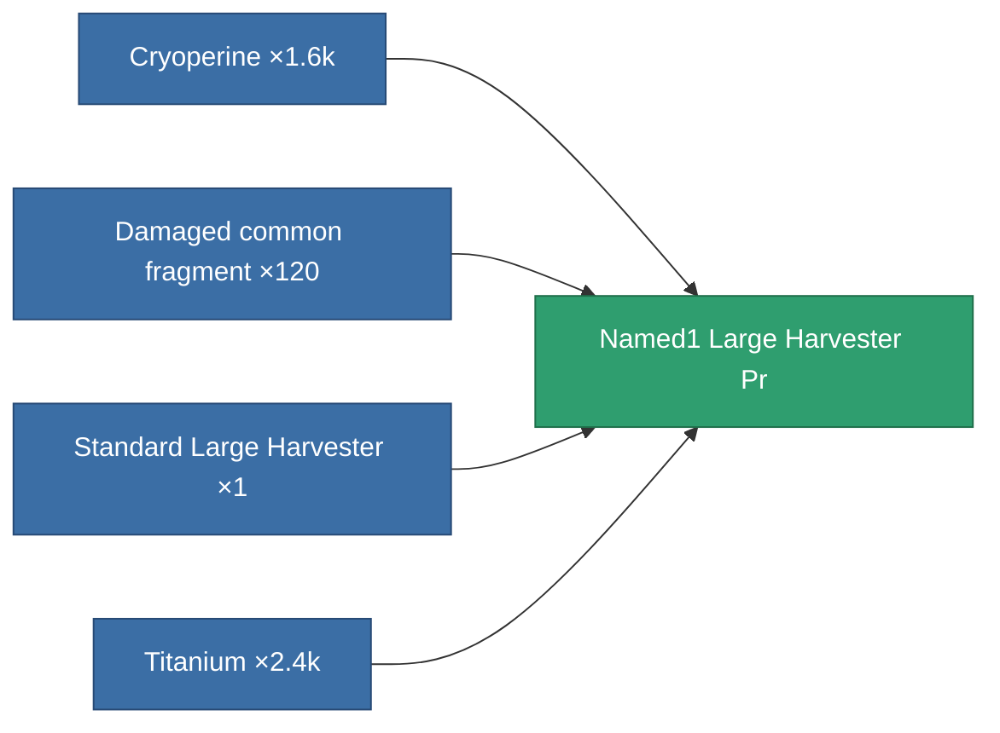

<!-- Generated by tools/generate from the live database (source: entitydefaults definition 8864, aggregatevalues via aggregatefields).
     Do not edit by hand; regenerate instead. -->

# Named1 Large Harvester Pr

|  |  |
|---|---|
| Definition | `def_named1_large_harvester_pr` |
| Tier | T2 (prototype) |
| Health | 100 |
| Volume | 2.5 |
| Mass | 1250 |
| Category | Modules / Harvesting |
| Tier line | [Standard Large Harvester](/content/items/standard-large-harvester/) (T1) → [Named1 Large Harvester](/content/items/named1-large-harvester/) (T2) → **Named1 Large Harvester Pr** (T2) → [Named2 Large Harvester](/content/items/named2-large-harvester/) (T3) → [Named3 Large Harvester](/content/items/named3-large-harvester/) (T4) |

## Stats

| Field | Value |
|---|---|
| core_usage | 195 |
| cpu_usage | 414 |
| cycle_time | 12k |
| powergrid_usage | 1.152k |

<!-- production:generated -->
## Production

**Produced from 4 components, research level 6** — assemble the components to build it (see [Recipes](/content/recipes/) for the full list):

[All items](/content/items/)
