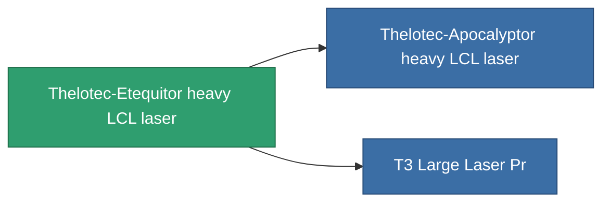

<!-- Generated by tools/generate from the live database (source: entitydefaults definition 837, aggregatevalues via aggregatefields).
     Do not edit by hand; regenerate instead. -->

# Thelotec-Etequitor heavy LCL laser

|  |  |
|---|---|
| Definition | `def_named1_large_laser` |
| Tier | T2 |
| Health | 100 |
| Volume | 1.5 |
| Mass | 900 |
| Category | Modules / Weapons |
| Tier line | [Standard heavy LCL laser](/content/items/standard-large-laser/) (T1) → **Thelotec-Etequitor heavy LCL laser** (T2) → [Thelotec-Apocalyptor heavy LCL laser](/content/items/named2-large-laser/) (T3) → [Kauska Heatpin II. heavy LCL laser](/content/items/named3-large-laser/) (T4) |

## Stats

| Field | Value |
|---|---|
| accuracy | 34.5 |
| core_usage | 9.52 |
| cpu_usage | 55 |
| cycle_time | 5k |
| damage_modifier | 1.91 |
| falloff | 10 |
| optimal_range | 22.5 |
| powergrid_usage | 315 |

<!-- production:generated -->
## Production

**Produced from 7 components** — assemble the components to build it (see [Recipes](/content/recipes/) for the full list):

<svg class="prod-card-icon" aria-hidden="true"><use href="#mi-grid"/></svg><a class="prod-card-name" href="/content/items/axicoline/">Axicoline</a>

required: <b>150</b>

<svg class="prod-card-icon" aria-hidden="true"><use href="#mi-grid"/></svg><a class="prod-card-name" href="/content/items/polynucleit/">Polynucleit</a>

required: <b>150</b>

<svg class="prod-card-icon" aria-hidden="true"><use href="#mi-crystal"/></svg><a class="prod-card-name" href="/content/items/robotshard-common-basic/">Damaged common fragment</a>

required: <b>45</b>

<svg class="prod-card-icon" aria-hidden="true"><use href="#mi-crystal"/></svg><a class="prod-card-name" href="/content/items/robotshard-thelodica-basic/">Damaged thelodica fragment</a>

required: <b>45</b>

<svg class="prod-card-icon" aria-hidden="true"><use href="#mi-grid"/></svg><a class="prod-card-name" href="/content/items/specimen-sap-item-flux/">Specimen Sap Item Flux</a>

required: <b>10</b>

<svg class="prod-card-icon" aria-hidden="true"><use href="#mi-robots"/></svg><a class="prod-card-name" href="/content/items/standard-large-laser/">Standard heavy LCL laser</a>

required: <b>1</b>

<svg class="prod-card-icon" aria-hidden="true"><use href="#mi-grid"/></svg><a class="prod-card-name" href="/content/items/titanium/">Titanium</a>

required: <b>150</b>

## Used in production

**Component of 2 items** — everything that uses it in production:

