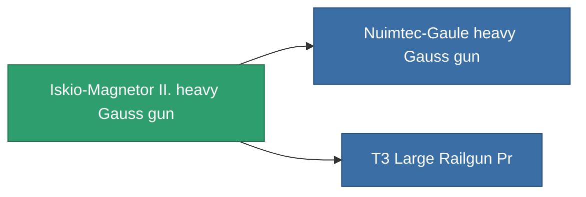

<!-- Generated by tools/generate from the live database (source: entitydefaults definition 864, aggregatevalues via aggregatefields).
     Do not edit by hand; regenerate instead. -->

# Iskio-Magnetor II. heavy Gauss gun

|  |  |
|---|---|
| Definition | `def_named1_large_railgun` |
| Tier | T2 |
| Health | 100 |
| Volume | 1.5 |
| Mass | 900 |
| Category | Modules / Weapons |
| Tier line | [Standard heavy Gauss gun](/content/items/standard-large-railgun/) (T1) → **Iskio-Magnetor II. heavy Gauss gun** (T2) → [Nuimtec-Gaule heavy Gauss gun](/content/items/named2-large-railgun/) (T3) → [Pentack-Nailer dd550 heavy Gauss gun](/content/items/named3-large-railgun/) (T4) |

## Stats

| Field | Value |
|---|---|
| accuracy | 40.5 |
| core_usage | 8.4 |
| cpu_usage | 62.5 |
| cycle_time | 6k |
| damage_modifier | 2.55 |
| falloff | 7.5 |
| optimal_range | 20 |
| powergrid_usage | 202.25 |

<!-- production:generated -->
## Production

**Produced from 7 components** — assemble the components to build it (see [Recipes](/content/recipes/) for the full list):

<svg class="prod-card-icon" aria-hidden="true"><use href="#mi-grid"/></svg><a class="prod-card-name" href="/content/items/axicoline/">Axicoline</a>

required: <b>150</b>

<svg class="prod-card-icon" aria-hidden="true"><use href="#mi-grid"/></svg><a class="prod-card-name" href="/content/items/polynitrocol/">Polynitrocol</a>

required: <b>150</b>

<svg class="prod-card-icon" aria-hidden="true"><use href="#mi-crystal"/></svg><a class="prod-card-name" href="/content/items/robotshard-common-basic/">Damaged common fragment</a>

required: <b>45</b>

<svg class="prod-card-icon" aria-hidden="true"><use href="#mi-crystal"/></svg><a class="prod-card-name" href="/content/items/robotshard-nuimqol-basic/">Damaged nuimqol fragment</a>

required: <b>45</b>

<svg class="prod-card-icon" aria-hidden="true"><use href="#mi-grid"/></svg><a class="prod-card-name" href="/content/items/specimen-sap-item-flux/">Specimen Sap Item Flux</a>

required: <b>10</b>

<svg class="prod-card-icon" aria-hidden="true"><use href="#mi-grid"/></svg><a class="prod-card-name" href="/content/items/standard-large-railgun/">Standard heavy Gauss gun</a>

required: <b>1</b>

<svg class="prod-card-icon" aria-hidden="true"><use href="#mi-grid"/></svg><a class="prod-card-name" href="/content/items/titanium/">Titanium</a>

required: <b>150</b>

## Used in production

**Component of 2 items** — everything that uses it in production:

