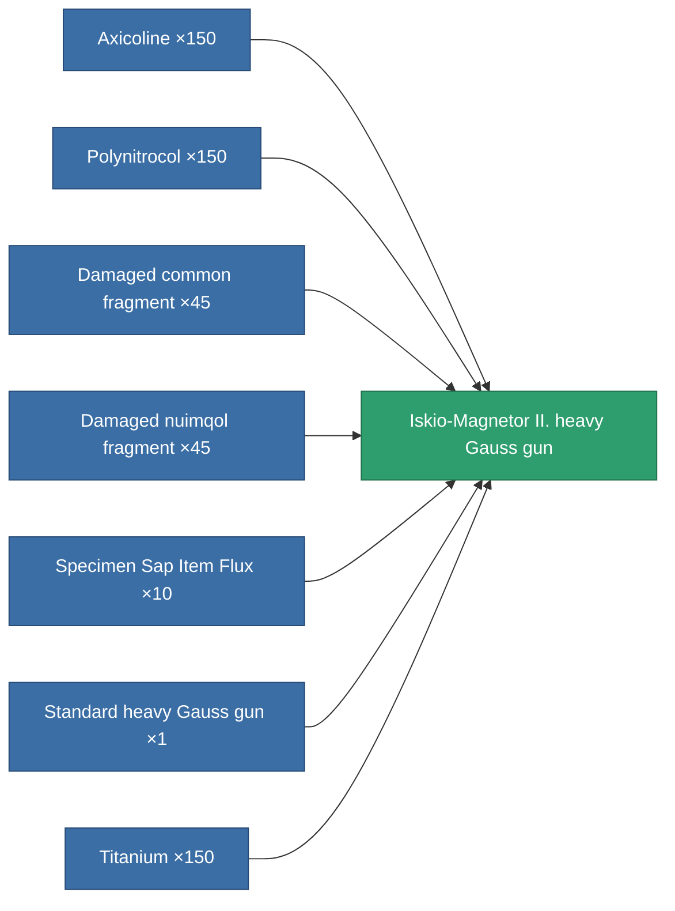
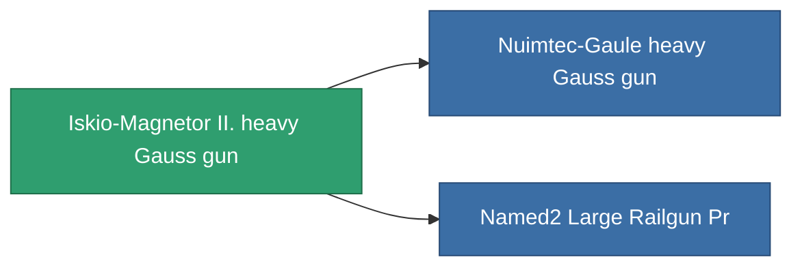

<!-- Generated by tools/generate from the live database (source: entitydefaults definition 864, aggregatevalues via aggregatefields).
     Do not edit by hand; regenerate instead. -->

# Iskio-Magnetor II. heavy Gauss gun

|  |  |
|---|---|
| Definition | `def_named1_large_railgun` |
| Tier | 2 |
| Health | 100 |
| Volume | 1.5 |
| Mass | 900 |
| Category | Modules / Weapons |

## Stats

| Field | Value |
|---|---|
| accuracy | 40.5 |
| core_usage | 8.4 |
| cpu_usage | 62.5 |
| cycle_time | 6k |
| damage_modifier | 2.55 |
| falloff | 7.5 |
| optimal_range | 20 |
| powergrid_usage | 202.25 |

<!-- production:generated -->
## Production

**Produced from 7 components** — assemble the components to build it (see [Recipes](/content/recipes/) for the full list):

## Used in production

**Component of 2 items** — everything that uses it in production:

[All items](/content/items/)
